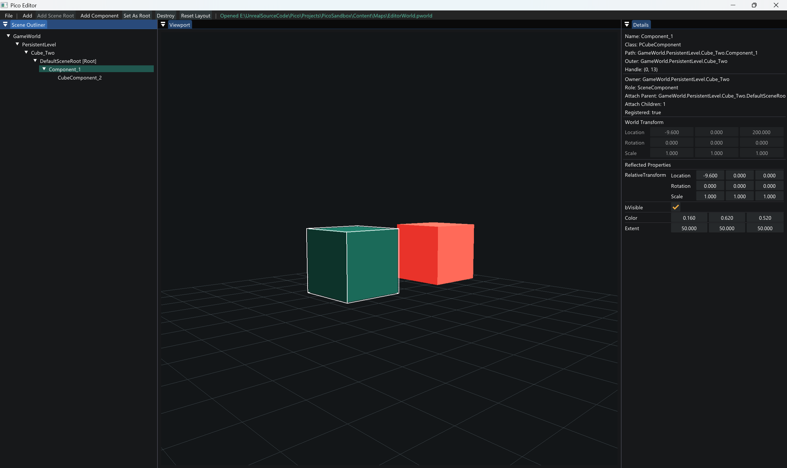

# Pico

[English](README.md) | [简体中文](README.zh-CN.md)

Pico is a small, learning-oriented C++ 3D engine inspired by Unreal Engine's architecture. The
project focuses on understanding how engine subsystems connect: startup, objects, reflection,
serialization, worlds, actors, components, transforms, editor tooling, and rendering.

Pico is not intended to compete with production engines. It deliberately keeps each system small
enough to study while preserving clear ownership boundaries and an end-to-end runtime.



## Current State

The first three development months are complete. Pico can currently:

- Run a UE-style `PreInit -> Init -> Tick -> Exit` engine loop.
- Create reflected native objects through `PClass` and `NewObject`.
- Register classes and properties with thin C++ reflection macros.
- Inspect and edit supported properties through generic metadata-driven UI.
- Serialize reflected objects to `.pobj` files and reconstruct them with `PostLoad`.
- Save validated World scene graphs to deterministic `.pworld` files and transactionally reconstruct runtime Worlds without persisting runtime handles.
- Transactionally replace the `FEngineLoop` active World while preserving the old World on load or `PostLoad` failure.
- Manage object memory centrally through `FObjectRegistry`, `Outer`, and generation-safe handles.
- Create `PWorld`, `PLevel`, `PActor`, and component instances with explicit lifecycles.
- Use a root scene component as the Actor transform provider.
- Build parent-child scene-component attachment trees with relative and world transforms.
- Open a `.pico` project with separate engine and project roots.
- Display runtime objects in an Outliner and Details panel.
- Render `PCubeComponent` instances in an interactive OpenGL 3.3 editor viewport.
- Rearrange dockable editor panels and persist each project's layout under `Saved/Editor`.
- Load modern OpenGL entry points through a dedicated GLAD target owned by `PicoRender`.

Debug and Release configurations build successfully, and all four automated test executables pass.

## Architecture

The primary dependency direction is:

```text
PicoEditor
  -> PicoRender
  -> PicoEngine
  -> PicoObject
  -> PicoCore
```

Supporting tools and samples depend on public runtime interfaces:

```text
PicoReflectionTools -> PicoObject
PicoSandbox         -> PicoEngine / PicoObject
PicoInspector       -> PicoReflectionTools
```

| Module | Responsibility |
| --- | --- |
| `PicoCore` | App state, command line, config, logging, names, paths, time, math, project descriptor |
| `PicoObject` | `PObject`, `PClass`, `PProperty`, reflection, registry, handles, Outer graph, serialization |
| `PicoEngine` | Engine loop, World, Level, Actor, components, attachment, primitive scene data |
| `PicoRender` | GLAD-backed OpenGL, shaders, geometry, framebuffer, scene traversal and draw submission |
| `PicoEditor` | Runtime Outliner, Details, scene editing, editor camera and 3D viewport |
| `PicoReflectionTools` | Generic metadata inspection and reflected-property helpers |
| `PicoSandbox` | Project-side reflection, serialization, editor and testing example |

The runtime modules do not depend on ImGui. `PicoCore`, `PicoObject`, and `PicoEngine` also remain
independent of GLFW and OpenGL.

## Runtime Object Model

Pico keeps four relationships separate:

```text
PClass       = what type an object is
Outer        = which object owns its name and lifetime
Handle       = how the registry safely resolves it later
AttachParent = which scene component provides its transform space
```

The current scene hierarchy is:

```text
PWorld
  -> PLevel
    -> PActor
      -> PActorComponent
        -> PSceneComponent
          -> PPrimitiveComponent
            -> PCubeComponent
```

`FObjectRegistry` owns object memory. Handles do not extend lifetime, and stale handles resolve to
`nullptr`. Outer defines naming and deterministic destruction order. This is the foundation for a
future tracing garbage collector, not a tracing GC implementation itself.

## Project Boundary

Pico separates engine installation data from user-authored project data:

```text
EngineRoot/
  Source/
  ThirdParty/
  Config/

ProjectRoot/
  MyGame.pico
  Source/
  Content/
  Config/
  Intermediate/
  Saved/
```

Automatic editor and tool writes are limited to project `Content`, `Intermediate`, and `Saved`.
Engine source and project source are not automatic write targets.

`Projects/PicoSandbox/PicoSandbox.pico` is the maintained example project. The same project shape
can live outside the Pico repository.

## Requirements

- Windows 10 or Windows 11 (x64)
- Visual Studio 2022 with the **Desktop development with C++** workload
- MSVC v143 and a Windows 10/11 SDK
- CMake 3.22 or newer
- Git for Windows
- A GPU and driver supporting OpenGL 3.3

GLFW and Dear ImGui are included under `ThirdParty`.

## Quick Start

```powershell
git clone https://github.com/zoroknight/Pico.git
Set-Location Pico
powershell -ExecutionPolicy Bypass -File .\Scripts\SetupWindows.ps1
```

The setup script checks the environment, generates a Visual Studio 2022 x64 build, compiles every
target, and runs the tests. Build products are written to `Build`.

Start the editor:

```powershell
.\Build\Debug\PicoEditor.exe .\Projects\PicoSandbox\PicoSandbox.pico
```

The editor starts maximized. Its default UI scale is `1.4`; override it when needed:

```powershell
.\Build\Debug\PicoEditor.exe .\Projects\PicoSandbox\PicoSandbox.pico -uiscale=1.6
```

## Editor Controls

The editor starts with an empty scene:

```text
GameWorld
  -> PersistentLevel
```

- Use `Add > Empty Actor` to create an editor-authored Actor with `DefaultSceneRoot`.
- Use `Add > Cube` to create an Actor whose renderable `PCubeComponent` is also its root.
- Add Scene or Cube components to a selected Actor, or add them as children of a selected scene
  component.
- Press `F2` to rename a selected Actor or Component and `Delete` to remove it. Deleting a scene
  component removes its complete attachment subtree.
- Right-click World, Level, Actor, or Component nodes for context-sensitive creation, rename, root,
  and delete commands.
- Left-click rendered geometry to select its owning Actor. Selecting an Actor outlines all of its
  visible CubeComponents; selecting a component in the Outliner outlines only that component.
- Use `Ctrl+Z` to undo and `Ctrl+Y` or `Ctrl+Shift+Z` to redo discrete create, delete, rename, add
  component, and root-component operations.
- Edit Actor transforms in the Details panel to move, rotate, and scale the cube.
- Edit `CubeComponent` reflected properties to change relative transform, extent, color, or visibility.
- Hold the right mouse button to capture the cursor and move the mouse to look around.
- While holding the right mouse button, use `W/A/S/D` to fly and `Q/E` to descend or ascend.
- Hold `Shift` to move four times faster; use the mouse wheel while flying to adjust camera speed.
- Use the toolbar to add scene children, choose a root, or destroy runtime objects.
- Drag panel tabs to rearrange or tab the workspace; use `Reset Layout` to restore the default.

Editor scene changes can be saved to and loaded from the active project's
`Content/Maps/EditorWorld.pworld` with `Ctrl+S` and `Ctrl+O`. Saving scene data never rewrites C++
source.

Editor panel layout is separate from scene data and persists in
`Projects/<ProjectName>/Saved/Editor/PicoEditorLayout.ini`.

## Programs and Samples

| Target | Purpose |
| --- | --- |
| `PicoLaunch` | Headless engine-loop and World lifecycle executable |
| `PicoEditor` | Runtime scene editor with OpenGL viewport |
| `PicoInspector` | Generic reflected-object inspector |
| `PicoReflectionDemo` | Console reflection walkthrough |
| `PicoSandboxDemo` | Complete project-side create, edit, save, destroy and load workflow |

Example commands:

```powershell
.\Build\Debug\PicoLaunch.exe -frames=5
.\Build\Debug\PicoReflectionDemo.exe
.\Build\Debug\PicoInspector.exe
.\Build\Projects\PicoSandbox\Debug\PicoSandboxDemo.exe
.\Build\Debug\PicoEditor.exe .\Projects\PicoSandbox\PicoSandbox.pico
```

## Build and Test

Generate and build manually:

```powershell
cmake -S . -B Build -G "Visual Studio 17 2022" -A x64
cmake --build Build --config Debug --parallel
ctest --test-dir Build -C Debug --output-on-failure
```

Build and test Release:

```powershell
powershell -ExecutionPolicy Bypass -File .\Scripts\SetupWindows.ps1 -Configuration Release
```

Open Pico in Visual Studio:

```text
Scripts\OpenFolder.bat
Scripts\GenerateProjectFiles.bat
Scripts\OpenSolution.bat
```

The generated solution is `Build\Pico.sln`.

## Repository Layout

```text
Pico/
  Config/                  Engine configuration
  Docs/                    Milestone and authoring documentation
  Projects/PicoSandbox/    Maintained external-style sample project
  Scripts/                 Windows setup and build scripts
  Source/
    Developer/             Development-only reflection tools
    Editor/                PicoEditor and PicoInspector
    Runtime/               Core, Object, Engine, Render and Launch
    Samples/               Reusable engine-side samples
  Tests/                   Core, Object, Engine and Sandbox tests
  ThirdParty/              GLAD, GLFW and Dear ImGui
```

## Reflection Authoring

Pico currently uses thin native C++ macros:

```cpp
class PExample final : public Pico::PObject
{
    PICO_DECLARE_CLASS(PExample, Pico::PObject)

private:
    Pico::int32 Health = 100;
};
```

The `.cpp` explicitly defines the class and reflected properties:

```cpp
PICO_DEFINE_CLASS(PExample)

bool PExample::RegisterProperties(Pico::PClass& Class)
{
    std::vector<Pico::PProperty> Properties;
    PICO_ADD_PROPERTY(Properties, Health);
    return Class.AddProperties(std::move(Properties));
}
```

There is no UHT-like header tool yet. A future PicoHeaderTool may generate this boilerplate while
continuing to use the same runtime metadata system.

See:

- [Reflection Authoring Guide](Docs/ReflectionAuthoringGuide.md)
- [PicoSandbox Guide](Projects/PicoSandbox/README.md)
- [Month 3 Editor Viewport](Docs/Month03_10_Editor3DViewport.md)
- [Month 3 Editor Docking](Docs/Month03_11_EditorDocking.md)
- [Month 3 GLAD Integration](Docs/Month03_12_GLADIntegration.md)

## Roadmap

The next stage focuses on turning the runtime editor into a persistent content workflow:

- Transactional World reconstruction and `.pworld` file save/load
- Asset registry and project content browser
- Static-mesh assets and model importing
- Transform gizmos and transactional Transform/property editing
- Render-scene caching, materials, textures and PBR

Later stages will explore:

- Tracing garbage collection
- Delegates and events
- Replication and RPC
- Physics and animation integration
- Packaging and generated project code
- Ray tracing
- A compact Gameplay Ability System if the core engine is mature enough

Detailed milestone notes are available in [`Docs`](Docs).
