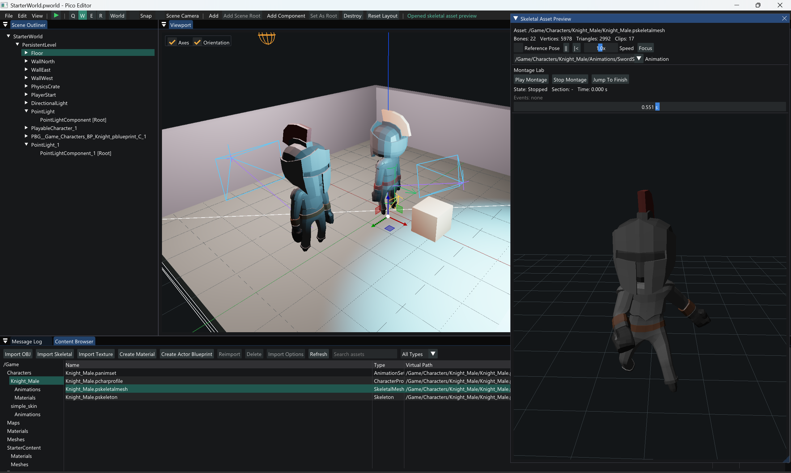

# Pico

[English](README.md) | [简体中文](README.zh-CN.md)

Pico is a small, learning-oriented C++ 3D engine inspired by Unreal Engine's architecture. The
project focuses on understanding how engine subsystems connect: startup, objects, reflection,
serialization, worlds, actors, components, transforms, editor tooling, and rendering.

Pico is not intended to compete with production engines. It deliberately keeps each system small
enough to study while preserving clear ownership boundaries and an end-to-end runtime.



## Current State

The current implementation can:

- Run a UE-style `PreInit -> Init -> Tick -> Exit` engine loop.
- Connect one server and multiple clients through `PicoNetCore` using a deterministic loopback lab or
  non-blocking Windows UDP, with versioned packets, handshake, Sequence/Ack, bounded ordered reliable
  delivery, heartbeat, timeout, and pre/post-World NetDriver phases.
- Replicate explicitly enabled Actors through per-connection ActorChannels, server-assigned NetObjectIds,
  stable reflection schemas, acknowledged property baselines, Spawn/Delta/Destroy, Transform state,
  InitialOnly conditions, zero-argument OnRep calls, and deferred type-checked Actor references.
- Run server-authoritative Character movement with bounded SavedMove redundancy, ownership and control-policy
  validation, autonomous-proxy prediction/correction/replay, plus Disabled, Linear, Exponential, and
  Snapshot Interpolation modes that smooth the visual Mesh without delaying the authoritative capsule.
- Validate that path in the PicoSandbox Replication Lab: an authority-spawned cube exposes matching
  NetId/InitialOnly state in three F1 panels, while server keys exercise Transform Delta, OnRep,
  Destroy, and fresh Spawn across two clients.
- Run the same Windows Development Stage across two physical Windows PCs on a LAN: PC A hosts the
  separate server and client 1, while PC B runs client 2; movement, jumping, and Gameplay RPCs stay
  synchronized through the authoritative UDP path.
- Configure editor Play as Standalone or a visible separate server plus one to four clients; persist
  port/window settings and launch, monitor, log, and stop the complete multi-process Play Session.
- Scope Windows `SIO_UDP_CONNRESET` suppression to each Pico UDP socket so startup-race Winsock
  `10054` reports remain retryable without changing other applications or bypassing handshake timeout.
- Run deterministic Agent workflows through UI-independent `PicoAgentCore`: injectable providers and
  tool executors, validated state transitions, bounded repair, cooperative cancellation, append-only
  JSONL sessions, checkpoints, restart recovery, and stable ToolCall idempotency.
- Validate Agent tools through deterministic JSON schemas, permission and approval policy, existing
  World snapshot transactions, postcondition verification, rollback, persistent stage traces, and
  conflict-safe ToolCall IDs; Agent-created Actors enter the normal editor Undo history.
- Discover Actor and Component `PProperty` metadata through generic Agent tools, then read or batch-edit
  supported `Editable` values in one approved Undo transaction without per-property tool code.
- Keep provider-isolated multi-chat histories with create/delete/recovery, newest-message scrolling,
  per-bubble copy, and MD4C-backed Markdown plus formatted JSON code blocks whose expansion does not
  steal the transcript's mouse wheel.
- Let the scene Agent search real AssetRegistry entries, create an undoable collision room, assemble a
  third-person Pawn from a Data-Only Actor Blueprint and Character Profile, validate/save the World,
  spawn or delete Blueprint Actors, create a content-only project from the proven template, and launch
  either a real Play Session or the existing approved packager through distinct tools and intent guards.
- Launch a standalone `PicoGame` runtime with frame-based input, configurable Action/Axis mappings,
  and a project default map or command-line map override.
- Build a project-specific `PicoSandboxGame` runtime whose statically linked Game Module registers
  native project classes before map loading and selects a reflected project `PGameInstance` class.
- Keep object creation, destruction, GC, reflected property writes, and World ticking on an explicit
  Game Thread, with worker-thread misuse rejected at the API boundary.
- Schedule Actor and ActorComponent updates through `FTickFunction`, four ordered TickGroups,
  same-World prerequisites, runtime enable/disable, and tick intervals.
- Construct a rooted `PGameInstance` through `PClass/NewObject` and notify it across Init, map load,
  Tick, World cleanup, and engine Shutdown.
- Model the first UE-inspired Gameplay Framework layer with persistent `PLocalPlayer`, World-owned
  GameMode/GameState, Controller/PlayerController, PlayerState, Pawn, and scene-authored PlayerStart.
- Configure project Gameplay classes on the GameMode CDO, keep runtime rule Actors transient, and
  preserve PlayerStart through normal editor transactions and `.pworld` reconstruction.
- Run Standalone players through `PPlayer`, GameMode Login/PostLogin, PlayerState registration,
  RestartPlayer, and paired Possess/UnPossess lifecycle operations.
- Drive `EnteringMap -> WaitingToStart -> InProgress -> WaitingPostMatch` through GameMode while
  GameState exposes replicated match data, elapsed time, and lifecycle notifications.
- Route mapped WASD input through a project PlayerController to its possessed Pawn, while retaining
  GameInstance and LocalPlayer and rebuilding World-owned Gameplay objects across map replacement.
- Drive a Character capsule through deterministic walking, jumping, falling, landing, wall sliding,
  floor probing, and dynamic-body pushing; expose replayable movement input/state for future prediction.
- Advance Jolt at a fixed 60 Hz with at most four substeps per World frame, while keeping backend
  types behind `PicoPhysicsCore` handles and query contracts.
- Play movement-driven Idle/Walk/Jump clips through native Skeleton, SkeletalMesh, AnimInstance,
  Pose, CPU skinning, and swept Root Motion boundaries without leaking Assimp or OpenGL types.
- Use `.panimset` locomotion references and Montage Lite with one slot, segments, sections, notifies,
  blend in/out, completion delegates, and root motion through the character movement boundary.
- Inspect Montage play/stop/section jumps and events in Skeletal Preview, with four reflected per-section
  material overrides available on SkeletalMeshComponent.
- Inspect ground speed, animation state, movement mode, current clip, and playback time independently
  in the standalone `Gameplay Debug` panel, so grounded `Walking` movement can be distinguished from
  an `Idle` animation at zero velocity.
- Import glTF/GLB or FBX from the Content Browser into a transient skeletal Preview World, inspect
  clips/reference pose with orbit, playback, speed, and timeline controls, then atomically create
  project-native assets without manually translating disk paths into `/Game` references.
- Convert glTF PBR materials, embedded/external textures, and multi-material sections in the
  developer-only import layer; persist default slot materials in `.pskeletalmesh` while retaining
  reflected per-slot component overrides.
- Edit Input and Gameplay defaults through `Edit -> Project Settings`, search project-native Actors
  through the Actor Class picker, and select a generated `.pcharprofile` instead of editing Pawn CDOs
  for every imported character.
- Author `.pblueprint` Data-Only Actor types in a dedicated Components/Preview/Details editor; compile
  reflected Actor and native-component overrides into a generated `PClass`, CDO, and default-subobject
  templates, then spawn or persist that stable generated class in a World.
- Open the Actor Blueprint editor as a separate native platform window, use arrowed local axes in its
  preview, and inspect or rotate the main editor view with optional world axes and an orientation gizmo.
- Launch into a project browser when no descriptor is supplied, keep user-level recent projects, accept
  either a `.pico` file or its containing folder, and restore each project's last World and open asset editors.
- Compose skeletal rendering from Actor world, component-relative, and Character Profile visual
  transforms so source-axis correction does not alter collision, movement, or future replicated facing.
- Match the UE third-person template's rotation ownership: `DoMove` converts ControlRotation yaw into
  world-space forward/right input, CharacterMovement turns the Actor toward movement, and SpringArm
  evaluates an independent camera target rotation instead of writing ControlRotation into its relative transform.
- Preserve that tuned behavior as a reusable `.pcontrolprofile` referenced by the Actor Blueprint;
  a shared movement-basis function, stable policy hash, F1 identity diagnostics, and 0/90-degree golden
  tests keep local prediction and future server replay on the same control semantics.
- Clamp reflected Controller view pitch to configurable limits (`-75` to `+55` degrees in Sandbox),
  and retract SpringArm through an optional UE-style sphere sweep with a configurable probe size.
- Show smoothed FPS/frame time in the editor through `View -> Frame Rate`; Editor, Game, and packaged
  executables use the Windows GUI subsystem and do not open a console by default. Editor startup logs
  persist under `Saved/Logs`, and `-console` or `-log` restores a diagnostic console on demand.
- Inspect the live Gameplay object chain, restart/destroy/repossess its Pawn, and reload the map from
  the standalone runtime's `Gameplay Debug` panel; inspect PlayerStart shape and validation in editor.
- Create PlayerStart from the editor toolbar, review persistent green/yellow/red diagnostics in
  `Message Log`, and explicitly confirm `Save & Play` before a dirty World is launched out of process.
- Author signature-checked dynamic event bindings in Details through `Events & Bindings`, including
  World-scoped target/function selection, Undo/Redo, dirty tracking, and `.pworld` restoration.
- Create reflected native objects through `PClass` and `NewObject`.
- Give every registered class a CDO, declare inherited default-subobject templates, and materialize
  independent runtime object graphs through one initialization path.
- Bind type-safe native single-cast and multicast delegates, including generation-safe weak object
  listeners and Actor spawn/destroy lifecycle events.
- Bind Callable reflected functions by weak object handle and function name through a signature-checked
  dynamic multicast delegate, then broadcast through `ProcessEvent`.
- Persist reflected dynamic multicast properties in `.pworld` files through scene IDs, object paths,
  and function names, then restore them after the new runtime object graph exists.
- Route reflected writes through pre/post property notifications with explicit ValueSet, Interactive,
  Load, and UndoRedo sources; CDO edits affect future instances without overwriting live objects.
- Complete the third project-month object-system milestone and the first three weeks of the fourth
  project month, including Game Thread/Tick scheduling and a runnable UE-inspired player lifecycle.
- Declare classes, properties, and functions beside native C++ members with `PCLASS`, `PPROPERTY`,
  and `PFUNCTION`; PicoHeaderTool generates the repetitive registration code before compilation.
- Invoke reflected native functions through `PObject::ProcessEvent` with typed parameters, return
  metadata, inherited lookup, lifecycle checks, and validated future RPC flags.
- Inspect and edit supported properties through generic metadata-driven UI.
- Use PicoInspector as a project-free developer sandbox: invoke reflected functions with generated
  parameter controls and visualize Native Delegate lifetime, GC reachability, merged requests,
  safe-point scheduling, and object-handle expiry.
- Serialize reflected objects to `.pobj` files and reconstruct them with `PostLoad`.
- Save validated World scene graphs to deterministic `.pworld` files and transactionally reconstruct runtime Worlds without persisting runtime handles.
- Transactionally replace the `FEngineLoop` active World while preserving the old World on load or `PostLoad` failure.
- Treat the editor World as a document with New, Open, Save, and Save As workflows, a stable
  `/Game/...` identity, dirty-state tracking, and save/discard/cancel protection.
- Manage object memory centrally through `FObjectRegistry`, `Outer`, and generation-safe handles.
- Collect unreachable runtime object graphs with a stop-the-world mark-sweep collector driven by
  Root Set, reflected strong/weak object references, `Outer`, and native `AddReferencedObjects` hooks.
- Create `PWorld`, `PLevel`, `PActor`, and component instances with explicit lifecycles.
- Use a root scene component as the Actor transform provider.
- Build parent-child scene-component attachment trees with relative and world transforms.
- Attach scene components to named parent sockets, persist socket relationships in `.pworld` v3,
  and load older v1/v2 scenes without socket data.
- Author runtime Camera, Spring Arm, Directional Light, and Point Light components through the
  same reflection, serialization, hierarchy, and editor transaction paths as other components.
- Open a `.pico` project with separate engine and project roots.
- Distinguish Development, Installed, and Staged runtime layouts through validated Engine/Stage
  markers, strict relative paths, version checks, and optional `-engineroot`/`-stageroot` overrides.
- Run the Release Sandbox from an external Stage with no `Source`, `CMakeLists.txt`, repository
  working directory, or explicit project argument; the manifest locates Engine, project, and assets.
- Package a saved project through the standalone `PicoPackager` or the editor File menu into an
  atomic Windows Development Stage, driven by a target receipt, native-asset contributors,
  validation, a file report, and an optional repository-external smoke test.
- Build `PicoPackager` automatically as a dependency of `PicoEditor`, so a standalone Release editor
  build always places the packaging tool beside the editor entry point.
- Explicitly replace a stable package name or create a side-by-side custom Stage; unique internal
  staging directories are cleaned after success or failure without damaging the last good package.
- Represent persistent references with validated `/Game/...` asset paths instead of machine-specific
  disk paths.
- Deterministically scan native `.pworld`, `.pmesh`, `.ptex`, and `.pmat` files into a project asset
  registry with case-insensitive lookup and refresh.
- Import triangulated OBJ source data through TinyObjLoader into a validated, deterministic `.pmesh`
  format with positions, normals, UVs, sections, and bounds.
- Import PNG/JPG/TGA/BMP images through stb_image into validated `.ptex` RGBA8 assets, and author
  `.pmat` assets with BaseColor, BaseColorTexture, Metallic, and Roughness.
- Assign reflected Material references to StaticMeshComponents with Undo/Redo and render them through
  an OpenGL 3.3 Cook-Torrance PBR path with renderer-owned texture caching and mipmaps.
- Cache immutable CPU static-mesh data and renderer-owned OpenGL mesh buffers, refreshing them when
  Registry metadata changes.
- Persist `PStaticMeshComponent` asset references and render, pick, highlight, and transform imported
  meshes in the editor viewport.
- Browse project assets by folder, search text, and type in a dockable Content Browser; import OBJ
  files, refresh the Registry, and reimport from project-local source metadata.
- Inspect OBJ geometry before import, choose automatic or explicit source units, preview final mesh
  dimensions, and reopen persisted settings through `Import Options`.
- Batch-delete mixed Static Mesh, Texture, and Material assets with scene/asset dependency
  reporting, optional project-source removal, transaction-backed scene cleanup, and staged rollback.
- Select assets by stable `/Game/...` paths, drag Static Mesh assets into Details, and create or
  transactionally assign mesh components without relying on Registry order.
- Keep reimportable user source files under `Content/Source`; editor-authored native runtime assets
  use type folders such as `Meshes`, `Textures`, `Materials`, and `Maps`.
- Display runtime objects in an Outliner and Details panel.
- Render `PCubeComponent` instances in an interactive OpenGL 3.3 editor viewport.
- Preview the first active scene Camera in the editor, including a Camera attached to the
  `SpringEndpoint` socket of a reflected Spring Arm.
- Visualize non-renderable scene components with selectable editor wireframes: Camera frustums,
  Directional Light arrows, compact Point Light icons with selection-only attenuation spheres,
  and Spring Arm endpoint lines.
- Shade PBR geometry with scene-authored Directional and Point Lights; scenes without authored
  lights retain the legacy default directional light.
- Select Actors and components individually, additively, by range, or with `Ctrl+A`; the viewport
  renders the complete selection set with scene highlights.
- Undo and redo scene hierarchy, Actor Transform, and reflected-property edits through editor
  transactions while restoring the complete multi-selection.
- Copy, paste, and delete multiple Actors in one command, or copy a SceneComponent attachment
  subtree, with remapped scene IDs and one transaction per command.
- Move, rotate, and scale single or multiple scene objects through an ImGuizmo-backed viewport
  gizmo with World/Local coordinates, snapping, primary-object pivots, cancellation, and Undo/Redo.
- Rearrange dockable editor panels and persist each project's layout under `Saved/Editor`.
- Load modern OpenGL entry points through a dedicated GLAD target owned by `PicoRender`.

Debug and Release configurations build successfully, all nineteen CTest targets pass, and the focused animation
suite passes 13/13 assertions.

## Architecture

The primary dependency direction is:

```text
PicoEditor
  -> PicoEditorCore
  -> PicoImGuizmo / PicoImGui
  -> PicoRender
  -> PicoEngine
  -> PicoAsset / PicoObject
  -> PicoCore
```

Supporting tools and samples depend on public runtime interfaces:

```text
PicoReflectionTools -> PicoObject
PicoHeaderTool      -> generated reflection C++
PicoAssetImport     -> PicoAsset / TinyObjLoader
PicoInspector       -> PicoReflectionTools

PicoSandboxGame
  -> PicoSandboxModule
  -> PicoGameRuntime
  -> PicoEngine / PicoInput / PicoRender
```

| Module | Responsibility |
| --- | --- |
| `PicoCore` | App state, command line, config, logging, names, paths, time, math, project descriptor |
| `PicoTasks` | Fixed worker pool, task state, cooperative cancellation, exception isolation, and a frame-budgeted Game Thread dispatcher |
| `PicoAgentCore` | Provider/runtime boundaries, Agent state machine, budgets, append-only sessions, checkpoints, recovery, and ToolCall idempotency |
| `PicoInput` | Frame-based key and pointer state plus configurable Action/Axis mappings |
| `PicoNetCore` | Network addresses and IDs, packet codec, deterministic loopback, non-blocking UDP, handshake, Ack, bounded reliable delivery, heartbeat, and timeout |
| `PicoAsset` | Validated virtual asset discovery, deterministic project registry, and file metadata |
| `PicoAssetImport` | Developer-only OBJ conversion into validated native static-mesh assets |
| `PicoObject` | Object model, reflection, delegates, strong/weak references, Root Set, mark-sweep GC, registry, handles, Outer graph, serialization |
| `PicoPhysicsCore` | Backend-neutral shapes, body handles, queries, hit results, and PhysicsScene contracts |
| `PicoPhysicsJolt` | Jolt 5.6.0 shape/body, fixed-step simulation, query, contact-event, and unit-conversion adapter |
| `PicoEngine` | Engine loop, World, Level, Actor, components, attachment, primitive scene data |
| `PicoRender` | GLAD-backed OpenGL, shaders, geometry, framebuffer, scene traversal and draw submission |
| `PicoGameRuntime` | Reusable project launch, GLFW window, input polling, frame loop, and runtime rendering |
| `PicoEditorCore` | UI-independent World documents, object/asset selection, asset operations, commands, clipboard, transactions, and transforms |
| `PicoEditor` | World file dialogs, Content Browser, asset workflow controller, Outliner, Details, editor camera, viewport picking, tool state, and transform gizmo UI |
| `PicoReflectionTools` | Generic metadata inspection and reflected-property helpers |
| `PicoHeaderTool` | Token-based parser and build-time generator for constrained native reflection annotations |
| `PicoSandboxModule` | Project classes, Game Module startup, GameInstance creation, reflection, serialization, and tests |

The core runtime modules `PicoCore`, `PicoAsset`, `PicoObject`, and `PicoEngine` remain independent
of ImGui, GLFW, and OpenGL. The reusable `PicoGameRuntime` launch layer uses GLFW, OpenGL, and ImGui
for the standalone window, rendering, and Development Gameplay Debug overlay.

## Runtime Object Model

Pico keeps four relationships separate:

```text
PClass       = what type an object is
Outer        = which object owns its name and lifetime
Handle       = how the registry safely resolves it later
AttachParent = which scene component provides its transform space
```

The current scene hierarchy is:

```text
PWorld
  -> PLevel
    -> PActor
      -> PActorComponent
        -> PSceneComponent
          -> PCameraComponent
          -> PSpringArmComponent
          -> PLightComponent
            -> PDirectionalLightComponent
            -> PPointLightComponent
          -> PPrimitiveComponent
            -> PCubeComponent
            -> PStaticMeshComponent
```

The current standalone player chain is:

```text
FGameEngine
  -> PGameInstance                         persists across map replacement
    -> PLocalPlayer : PPlayer              persists across map replacement
      -> PPlayerController                 belongs to the current World
        -> PPlayerState                    registered in the current GameState
        -> PPawn / PCharacter              controlled through Possess
             -> Capsule + CharacterMovement

PWorld
  -> PGameModeBase                         Login, Logout, RestartPlayer and rules
  -> PGameStateBase                        shared World state and PlayerState list
  -> PLevel
    -> PPlayerStart                        authored spawn transform
```

GameMode logs each LocalPlayer in, creates its Controller and PlayerState, registers the PlayerState
with GameState, chooses a PlayerStart, spawns the configured default Pawn, and calls `Possess`.
`UnPossess` only removes the bidirectional control relationship; it does not destroy the Pawn.
`RestartPlayer` replaces the Pawn while preserving the Controller and PlayerState. Map replacement
preserves GameInstance and LocalPlayer, cleans up every old World-owned Gameplay object, then logs
the persistent LocalPlayer into the new World and creates a fresh Controller, PlayerState, and Pawn.
GameMode alone changes MatchState; GameState exposes the current state and match clock for later
replication. Native delegates report engine lifecycle transitions, while reflected dynamic events
are scene-authored in the Details panel and persist by stable object identity plus function name.

`FObjectRegistry` owns object memory. Handles do not extend lifetime, and stale handles resolve to
`nullptr`. Outer defines naming and deterministic destruction order and forms a child-to-parent GC
reference. Root Set, reflected strong references, and native reference hooks drive stop-the-world
mark-sweep collection; weak references never keep their targets alive. EngineLoop consumes deferred
GC requests at a post-World-tick safe point, with timed, World-transition, and engine-exit triggers.

## Project Boundary

Pico separates engine installation data from user-authored project data:

```text
EngineRoot/
  Source/
  ThirdParty/
  Config/

ProjectRoot/
  MyGame.pico
  Source/
  Content/
  Config/
  Intermediate/
  Saved/
```

Automatic editor and tool writes are limited to project `Content`, `Intermediate`, and `Saved`.
Engine source and project source are not automatic write targets.

`Projects/PicoSandbox/PicoSandbox.pico` is the maintained example project. The same project shape
can live outside the Pico repository.

Native project assets use virtual identifiers such as `/Game/Maps/EditorWorld.pworld`. The registry
maps those identifiers to files under the active project's `Content` directory; persistent scene and
object data never stores an absolute workstation path.

## Requirements

- Windows 10 or Windows 11 (x64)
- Visual Studio 2022 with the **Desktop development with C++** workload
- MSVC v143 and a Windows 10/11 SDK
- CMake 3.22 or newer
- Git for Windows
- A GPU and driver supporting OpenGL 3.3

GLFW, Dear ImGui, ImGuizmo, TinyObjLoader, and stb_image are included under `ThirdParty`. Jolt Physics
is fetched by CMake and pinned to commit `e77f175595e64cb44218cc9d9d56fc365ad0e36a`.
Assimp is an optional source dependency for skeletal glTF/GLB and FBX import. Place its source tree at
`ThirdParty/Assimp` (the default `PICO_ASSIMP_SOURCE_DIR`) and CMake will use it automatically; the
directory is intentionally Git-ignored because of its size. A system package or
`-DPICO_FETCH_ASSIMP=ON` remains available as a fallback.

## Quick Start

```powershell
git clone https://github.com/zoroknight/Pico.git
Set-Location Pico
powershell -ExecutionPolicy Bypass -File .\Scripts\SetupWindows.ps1
```

The setup script checks the environment, generates a Visual Studio 2022 x64 build, compiles every
target, and runs the tests. Build products are written to `Build`.

Start the editor:

```powershell
.\Build\Debug\PicoEditor.exe .\Projects\PicoSandbox\PicoSandbox.pico
```

Starting `PicoEditor.exe` without arguments opens the Project Browser. It accepts a `.pico` file or a
folder containing exactly one descriptor, and restores the project's previous editor session.

The editor does not open a console by default. Its complete startup and runtime log is written to
`Projects/<ProjectName>/Saved/Logs/PicoEditor.log`; Warning and Error records are also forwarded to
the editor Message Log. Add `-console` or `-log` when an interactive diagnostic console is useful.

The editor starts maximized. Its default UI scale is `1.4`; override it when needed:

```powershell
.\Build\Debug\PicoEditor.exe .\Projects\PicoSandbox\PicoSandbox.pico -uiscale=1.6
```

Start the game runtime without editor UI:

```powershell
.\Build\Debug\PicoSandboxGame.exe .\Projects\PicoSandbox\PicoSandbox.pico
```

After changing shared Engine/Render code, rebuild both the editor and project runtime before Play.
Compatibility is checked through project/Engine versions and actual startup rather than file
timestamps, because an up-to-date CMake target may legitimately be older than a rebuilt editor:

```powershell
cmake --build Build --config Release --target PicoEditor PicoSandboxGame --parallel 8
```

The project runtime reads `[Game] DefaultMap`, Gameplay class/profile defaults, and the Action/Axis mappings in `[Input]` from
`Config/Pico.ini`. `[Game] Executable` selects the project program used by editor Play.
`-map=/Game/Maps/Example.pworld` overrides the default map, and `-frames=N` supports automated
smoke runs. The generic `PicoGame` target remains available for projects without native code.

The editor toolbar's green triangle launches the current `/Game/...` map. Its adjacent native down-arrow menu selects
Standalone or a visible separate server plus one to four clients, and persists player count, port,
client window size, target RTT, jitter, and packet loss in `Saved/Editor/PlaySettings.ini`. The editor applies half of the target RTT
as each process's outgoing latency. Instances have `Server`/`Client_1` titles
and independent logs under `Saved/Logs/PlaySession/Session_*/`; the red square stops the whole group.
Character protocol v2 carries client/server movement timestamps. Simulated proxies use a bounded
25-100 ms adaptive smoothing window derived from snapshot cadence and jitter, while F1 reports move RTT,
snapshot transit, clock offset, remote Actor/Mesh vertical separation, and animation playback state. The
three-process acceptance matrix is documented in
[`Docs/Month09_4_5_LowLatencyVisualAcceptance.zh-CN.md`](Docs/Month09_4_5_LowLatencyVisualAcceptance.zh-CN.md).
A dirty or untitled World still requires explicit `Save & Play`. Listen Server and a truly headless
Dedicated Server remain reserved until the replication/runtime split is ready.

PicoSandbox's Week 2 Replication Lab starts automatically in Standalone or Server mode. In a visible
server plus two clients, use `Y` to move the authority Actor, `U` to change its replicated revision and
color, `I` to destroy it, and `T` to spawn it again. F1 Project Debug shows the shared NetId, location,
InitialOnly marker, revision, and endpoint-local OnRep count.

## Editor Controls

The editor starts with an empty scene:

```text
GameWorld
  -> PersistentLevel
```

- Use `Add > Empty Actor` to create an editor-authored Actor with `DefaultSceneRoot`.
- Use `Add > Cube` to create an Actor whose renderable `PCubeComponent` is also its root.
- Use `Add > Player Start` to create the Gameplay spawn point. The same command is available from
  the World or Level context menu under `Add Actor`; the viewport displays its capsule and direction.
- Use `Add > Camera`, `Spring Arm`, `Directional Light`, or `Point Light` to create reflected,
  transaction-backed scene actors. The same types are available under `Add Component`.
- To build a camera rig, select a Spring Arm component and add a Camera component. Pico attaches
  it to the named `SpringEndpoint` socket automatically. Edit `TargetArmLength`, `SocketOffset`,
  and `TargetOffset` in Details.
- Enable `Scene Camera` in the toolbar to preview the first active Camera component. Disable it to
  return to the independent editor fly camera.
- Edit a Light component's `bEnabled`, `LightColor`, and `Intensity`; Point Lights additionally
  expose `AttenuationRadius`. The renderer currently uses one Directional Light and up to four
  Point Lights.

Camera-rig parameter reference:

| Component | Property | Meaning |
| --- | --- | --- |
| Camera | `bActive` | Makes the component eligible for `Scene Camera`; the first active Camera is used. |
| Camera | `VerticalFieldOfViewDegrees` | Vertical field of view in degrees; larger values show a wider view. |
| Camera | `NearPlane` / `FarPlane` | Nearest and farthest rendered distances. |
| Spring Arm | `TargetArmLength` | Distance from the arm origin to `SpringEndpoint` along local `-X`. |
| Spring Arm | `TargetOffset` | World-space offset applied to the arm origin. |
| Spring Arm | `SocketOffset` | Arm-local offset applied at `SpringEndpoint`, useful for over-shoulder cameras. |
| Spring Arm | `Do Collision Test` | Enables the camera-path collision sweep; disabling it always uses the ideal arm length. |
| Spring Arm | `Probe Size` | Radius of the camera collision sphere; Sandbox defaults to `12`. |

An attached Camera normally keeps an identity Relative Transform and lets the Spring Arm control
distance, rotation, offset, and collision retraction. The sweep ignores PrimitiveComponents owned by
the same Actor so the character does not retract its own camera. Camera lag is not implemented yet.
- Select a `.pmesh` in Content Browser, then use `Add > Static Mesh` or double-click the asset to
  create an Actor. `Ctrl` toggles assets, `Shift` selects a range, and `Ctrl+A` selects every asset
  visible under the current folder, search, and type filters.
- Use `Import OBJ` to inspect source geometry, choose Auto/Centimeters/Meters/Millimeters/Normalize/
  Custom scaling, copy the source into `Content/Source/Meshes`, and build a native `.pmesh` under
  `Content/Meshes`.
- Use `Import Texture` to create a native `.ptex`, then `Create Material` to edit BaseColor,
  BaseColorTexture, Metallic, and Roughness. Double-click a `.pmat` to edit it later.
- With Content Browser focused, press `Delete` or use its Delete button to review scene and asset
  references and remove selected Static Mesh, Texture, and Material assets as one batch.
  Scene-focused `Delete` still removes objects.
  `Reimport` uses the saved settings; `Import Options` edits them before rebuilding.
- Use `Delete` to review references before removing assets. Project-local source deletion is
  optional; scene cleanup is one Undo/Redo transaction, Material-to-Texture references are updated
  transactionally with staged files, and file deletion itself is not a World transaction.
- Drag a Static Mesh row onto the Details `AssetPath` value, or use `Use Selected` and `Clear`.
  Assignment and clearing participate in scene Undo/Redo; import and reimport do not.
- Add Scene or Cube components to a selected Actor, or add them as children of a selected scene
  component.
- Press `F2` to rename a selected Actor or Component and `Delete` to remove it. Deleting a scene
  component removes its complete attachment subtree.
- Right-click World, Level, Actor, or Component nodes for context-sensitive creation, rename, root,
  and delete commands.
- Left-click rendered geometry to select its owning Actor. Selecting an Actor outlines all of its
  visible CubeComponents; selecting a component in the Outliner outlines only that component.
- Hold `Ctrl` while clicking to toggle objects in the selection. Hold `Shift` in the Outliner to
  select a range, or use `Ctrl+A` to select all scene Actors.
- Press `Q` for selection, `W` for translation, `E` for rotation, and `R` for scale. The toolbar
  exposes the same transform modes.
- Press `F` to frame selected Actors or components from their transformed world bounds. Camera
  distance, near plane, and movement speed adapt to very small and very large meshes.
- Use `World` coordinates to align the gizmo with the scene axes, or `Local` coordinates to align
  it with the primary selected object's rotation. Multi-object rotation and scaling use the primary
  object as their pivot.
- Enable `Snap` to quantize translation, rotation, and scale. Press `Esc` during a drag to restore
  every target to its pre-drag transform.
- An Actor gizmo uses its root component as the Actor pivot. If visible geometry is offset beneath
  a `DefaultSceneRoot`, select the child component in the Outliner to transform it around the
  geometry's own origin.
- Use `Ctrl+Z` to undo and `Ctrl+Y` or `Ctrl+Shift+Z` to redo scene hierarchy, Actor Transform, and
  reflected-property edits. One continuous value drag creates one transaction.
- Use `Ctrl+C` and `Ctrl+V` to copy and paste an Actor with all of its components, or a selected
  SceneComponent with its complete attachment subtree. Paste is one undoable transaction.
- Edit Actor transforms in the Details panel to move, rotate, and scale the cube.
- Edit `CubeComponent` reflected properties to change relative transform, extent, color, or visibility.
- Hold the right mouse button to capture the cursor and move the mouse to look around.
- While holding the right mouse button, use `W/A/S/D` to fly and `Q/E` to descend or ascend.
- Hold `Shift` to move four times faster; use the mouse wheel while flying to adjust camera speed.
- Use the toolbar to add scene children, choose a root, or destroy runtime objects.
- Drag panel tabs to rearrange or tab the workspace; use `Reset Layout` to restore the default.

Use `Ctrl+N` to create an untitled World, `Ctrl+O` to choose a `.pworld` under project Content,
`Ctrl+S` to save the current document, and `Ctrl+Shift+S` to choose a new file. World assets can
also be opened from the Content Browser. The window title marks dirty documents with `*`, and
New, Open, and Exit offer save/discard/cancel protection. Failed loads preserve the current World
and document identity; safe saves use temporary replacement and retain a `.bak` of overwritten files.
Saving scene data never rewrites C++ source.

The bottom `Message Log` records editor operations and Play validation with green Info, yellow
Warning, and red Error entries. Its `Clear` button and message count remain fixed while the entries
scroll independently. Reopen the panel through `View > Message Log`. Missing PlayerStart and
duplicate IDs allow `Play Anyway`; invalid PlayerStart scene roots block Play.

Editor panel layout is separate from scene data and persists in
`Projects/<ProjectName>/Saved/Editor/PicoEditorLayout.ini`.

## Programs and Samples

| Target | Purpose |
| --- | --- |
| `PicoLaunch` | Headless engine-loop and World lifecycle executable |
| `PicoEditor` | Runtime scene editor with OpenGL viewport |
| `PicoGameRuntime` | Reusable GLFW/input/render loop linked by game targets |
| `PicoGame` | Generic standalone runtime without project-native code |
| `PicoSandboxGame` | Project runtime with Sandbox module, GameInstance, and controllable Pawn |
| `PicoInspector` | Project-free developer sandbox for reflected objects, functions, and subsystem experiments |
| `PicoReflectionDemo` | Console reflection walkthrough |
| `PicoAssetTool` | Developer command-line OBJ to `.pmesh` importer |
| `PicoSandboxDemo` | Complete project-side create, edit, save, destroy and load workflow |

Example commands:

```powershell
.\Build\Debug\PicoLaunch.exe -frames=5
.\Build\Debug\PicoReflectionDemo.exe
.\Build\Debug\PicoAssetTool.exe import-obj source.obj destination.pmesh
.\Build\Debug\PicoInspector.exe
.\Build\Projects\PicoSandbox\Debug\PicoSandboxDemo.exe
.\Build\Debug\PicoSandboxGame.exe .\Projects\PicoSandbox\PicoSandbox.pico
.\Build\Debug\PicoEditor.exe .\Projects\PicoSandbox\PicoSandbox.pico
```

PicoInspector starts in its Native Delegate experiment. Use `Runtime Browser -> Functions` for
generic `ProcessEvent` calls, or `Experiments` to inspect native listener lifetime, dynamic PFunction
bindings, property notifications and CDO inheritance, GC object graphs, and deferred requests consumed at a safe point. See the
[visual verification guide](Docs/PicoInspector_VisualVerificationGuide.zh-CN.md) for the test sequence
and the purpose of every step. In the Dynamic Multicast experiment, `Remove Selected` removes one
delegate handle, `Remove Target Bindings` removes every binding owned by the selected target, and
`Clear All` empties the delegate. Its default UI scale is `1.4`; override it with values such as
`-uiscale=1.6` when needed.

## Build and Test

Generate and build manually:

```powershell
cmake -S . -B Build -G "Visual Studio 17 2022" -A x64
cmake --build Build --config Debug --parallel
ctest --test-dir Build -C Debug --output-on-failure
```

Build and test Release:

```powershell
powershell -ExecutionPolicy Bypass -File .\Scripts\SetupWindows.ps1 -Configuration Release
```

Build and package PicoSandbox as a Windows Development Stage:

```powershell
powershell -ExecutionPolicy Bypass -File .\Scripts\PackageProject.ps1
```

The output is `Projects/PicoSandbox/Saved/StagedBuilds/PicoSandbox-Windows-Development`.
Pass `-StageName PicoSandbox_TestPackage` for a side-by-side test package. Updating an existing stable
name from the editor requires explicit `Replace Package` confirmation.

Open Pico in Visual Studio:

```text
Scripts\OpenFolder.bat
Scripts\GenerateProjectFiles.bat
Scripts\OpenSolution.bat
```

The generated solution is `Build\Pico.sln`.

## Repository Layout

```text
Pico/
  Config/                  Engine configuration
  Docs/                    Milestone and authoring documentation
  Projects/PicoSandbox/    Maintained external-style sample project
  Scripts/                 Windows setup and build scripts
  Source/
    Developer/             Development-only reflection tools
    Editor/                PicoEditor and PicoInspector
    Runtime/               Core, Object, Engine, Render and Launch
    Samples/               Reusable engine-side samples
  Tests/                   Core, Object, Engine and Sandbox tests
  ThirdParty/              GLAD, GLFW, Dear ImGui and ImGuizmo
```

## Reflection Authoring

PicoHeaderTool parses constrained native annotations before C++ compilation:

```cpp
PCLASS()
class PExample final : public Pico::PObject
{
    GENERATED_BODY()

private:
    PPROPERTY()
    Pico::int32 Health = 100;
};
```

The generated header supplies class declarations and the generated source registers metadata through
the existing `PClass`, `PProperty`, and `PFunction` runtime. Generated files live under `Build/Generated`.

See:

- [AI-First Development Roadmap (Chinese)](Docs/Pico_AI_First_Development_Roadmap.zh-CN.md)
- [PicoTasks and Game Thread Dispatcher (Chinese)](Docs/AIPhase01_PicoTasksAndGameThreadDispatcher.md)
- [Pico Agent Core and Recoverable Sessions (Chinese)](Docs/AIPhase02_PicoAgentCoreAndSessions.md)
- [Agent Tool Safety Pipeline and Editor Transactions (Chinese)](Docs/AIPhase03_AgentToolPipeline.md)
- [AI Chat Workspace and DeepSeek/Kimi Providers (Chinese)](Docs/AIPhase04_ChatWorkspaceAndProviders.md)
- [Generic Reflected Property Tools for the Scene Agent (Chinese)](Docs/AIPhase05_ReflectedPropertyTools.md)
- [AI Game Assembly Vertical Slice (Chinese)](Docs/AIPhase06_GameAssemblyVerticalSlice.md)
- [Remaining Development Roadmap (Chinese)](Docs/Pico_Remaining_Development_Roadmap.zh-CN.md)
- [Pre-Network Readiness (Chinese)](Docs/Month08_14_PreNetworkReadiness.md)
- [Network Risk Register (Chinese)](Docs/NetworkRiskRegister.zh-CN.md)
- [Network Transport, Connection, and Frame Phases (Chinese)](Docs/Month09_1_NetTransportAndConnection.md)
- [Actor and Property Replication with Visual Lab (Chinese)](Docs/Month09_2_ActorReplication.md)
- [Reusable Third-Person Control Baseline (Chinese)](Docs/Month09_3_5_ThirdPersonControlBaseline.md)
- [Character Network Movement, Prediction, and Interpolation (Chinese)](Docs/Month09_4_CharacterNetworkMovement.md)
- [Reflection Authoring Guide](Docs/ReflectionAuthoringGuide.md)
- [PicoHeaderTool](Docs/Month03_17_PicoHeaderTool.md)
- [Mark-Sweep Garbage Collection](Docs/Month03_18_GarbageCollection.md)
- [Dynamic Multicast Delegates](Docs/Month03_19_DynamicMulticastDelegates.md)
- [Stable References and Property Notifications](Docs/Month03_20_StableReferencesAndPropertyNotifications.md)
- [Native Delegate Authoring Guide (Chinese)](Docs/DelegateAuthoringGuide.md)
- [PicoInspector Developer Sandbox Plan (Chinese)](Docs/PicoInspector_DeveloperSandbox_Plan.zh-CN.md)
- [PicoInspector Visual Verification Guide (Chinese)](Docs/PicoInspector_VisualVerificationGuide.zh-CN.md)
- [PicoSandbox Guide](Projects/PicoSandbox/README.md)
- [Month 3 Editor Viewport](Docs/Month03_10_Editor3DViewport.md)
- [Month 3 Editor Docking](Docs/Month03_11_EditorDocking.md)
- [Month 3 GLAD Integration](Docs/Month03_12_GLADIntegration.md)
- [Month 4 Editor Transactions](Docs/Month04_9_EditorTransactions.md)
- [Month 4 Property Transactions](Docs/Month04_10_EditorPropertyTransactions.md)
- [Month 4 Editor Clipboard](Docs/Month04_11_EditorClipboard.md)
- [Project Game Module and Runtime Target](Docs/Month06_2_ProjectGameModule.md)
- [Game Thread, Tick Scheduling, and PGameInstance](Docs/Month07_1_GameThreadTickAndGameInstance.md)
- [Gameplay Framework Types and Ownership](Docs/Month07_2_GameplayFrameworkTypes.md)
- [Standalone Login, Possess, and Gameplay Debug](Docs/Month07_3_StandaloneLoginPossessAndGameplayDebug.md)
- [MatchState, Gameplay Events, and Editor Bindings](Docs/Month07_4_MatchStateGameplayEventsAndBindings.md)
- [Development, Installed, and Staged Runtime Layouts](Docs/Month07_5_DevelopmentInstalledAndStagedLayouts.md)
- [Movement Foundation](Docs/Month08_1_MovementFoundation.md)
- [Jolt Physics Scene](Docs/Month08_2_JoltPhysics.md)
- [Character Movement](Docs/Month08_3_CharacterMovement.md)
- [Skeletal Animation](Docs/Month08_4_SkeletalAnimation.md)
- [Skeletal Asset Preview And Import](Docs/Month08_5_SkeletalAssetPreview.md)
- [Montage Lite And Character Assembly](Docs/Month08_6_MontageAndCharacterAssembly.md)
- [Character Import, Playable Pawn, And Project Settings](Docs/Month08_7_CharacterImportAndProjectSettings.md)
- [Character Control And Camera Policy](Docs/Month08_8_CharacterControlAndCameraPolicy.md)
- [Data-Only Actor Blueprint And Character Assembly](Docs/Month08_9_DataOnlyActorBlueprint.md)
- [Editor Viewport Orientation And Native Asset Windows](Docs/Month08_10_EditorViewportOrientation.md)
- [Project Browser And Editor Session Restore](Docs/Month08_11_ProjectBrowserAndEditorSession.md)
- [Initial Windows Development Packaging](Docs/Month08_12_InitialPackaging.md)
- [Runtime Window, FPS, and Third-Person Camera Polish](Docs/Month08_13_RuntimeCameraAndWindowPolish.md)
- [Class Default Objects and Unified Construction](Docs/Month03_13_ClassDefaultObjects.md)
- [Default Subobject Templates](Docs/Month03_14_DefaultSubobjects.md)
- [Native Delegates and Weak Object Binding](Docs/Month03_15_NativeDelegates.md)
- [Reflected Functions and ProcessEvent](Docs/Month03_16_ReflectedFunctions.md)
- [Network Transport and Connections](Docs/Month09_1_NetTransportAndConnection.md)
- [Actor and Property Replication](Docs/Month09_2_ActorReplication.md)
- [Gameplay RPC and Ownership](Docs/Month09_3_GameplayRpcAndOwnership.md)
- [Reusable Third-Person Control Baseline](Docs/Month09_3_5_ThirdPersonControlBaseline.md)
- [Character Network Movement and Prediction](Docs/Month09_4_CharacterNetworkMovement.md)

## Roadmap

The project-month-5 runtime scope is complete, including the movement foundation, Jolt PhysicsScene,
deterministic CharacterMovement, native skeletal-animation assets, AnimInstance state selection,
CPU skinning, and swept Root Motion. The local Assimp 6.0.4 source integration and real glTF/FBX
skeletal import paths have been accepted with Assimp's official fixtures in Debug and Release. The
asset-driven editor, rendering path, standalone Play, reflected GameInstance lifecycle, explicit
Game Thread boundary, TickFunction scheduler, Gameplay type ownership, MatchState, lifecycle events,
persistent editor bindings, map replacement, and runtime Gameplay Debug are complete through project
month 4. Controller input now flows through Character input accumulation, CharacterMovement, and the
shared MoveComponent boundary. See [Movement Foundation](Docs/Month08_1_MovementFoundation.md),
[Jolt Physics Scene](Docs/Month08_2_JoltPhysics.md), and
[Character Movement](Docs/Month08_3_CharacterMovement.md), and
[Skeletal Animation](Docs/Month08_4_SkeletalAnimation.md).
The editor can now author a persistent playable Pawn from a project Pawn class and Character Profile.
Runtime login prefers that map instance through Auto Possess Player 0, while project defaults remain
the fallback. Controller ControlRotation, mouse capture, SpringArm camera rotation, view-relative WASD,
movement-facing rotation, and eight material overrides complete the third-person character assembly.
PicoSandbox now opens a persistent Starter World with reusable cube/PBR assets, an authored floor,
walls, a dynamic crate, PlayerStart, and scene lights. Component material overrides take precedence
over Character Profile and imported mesh defaults; slots without mesh sections are shown as unused.
The Data-Only Actor Blueprint editor now separates reusable Actor/component defaults from level
instances and gives PicoSandbox a generated default Pawn class. Event Graph behavior remains the
later PicoGraph milestone rather than being coupled to this assembly workflow.
The pre-network runtime baseline now exposes explicit `BeforeWorldTick` and `AfterWorldTick` frame
slots. `PGameInstance` runs before World simulation, while GC and frame pacing remain after the
World and post-World callback. Editor document tests use a temporary project copy and cannot modify
the working PicoSandbox map. See [Pre-Network Readiness](Docs/Month08_14_PreNetworkReadiness.md).
The network stack now includes UDP connections, reliable ordered messages, per-connection ActorChannels,
Spawn/Delta/Destroy replication, ownership-aware roles, and reflected Server/Client/Multicast RPC. PicoSandbox
contains a client-to-server door interaction whose durable state is replicated while Client and Multicast RPCs
provide directed and transient feedback. Runtime F1 diagnostics expose roles, NetIds, channels, RPC rejection,
and reliable/unreliable message counters.

Project month 6 is complete for the learning MVP. Character movement now adds ordered SavedMoves,
autonomous-proxy prediction, server replay and validation, Ack/Correction with unacknowledged-move replay,
simulated-proxy interpolation or bounded extrapolation, and independent Mesh smoothing. A deterministic
36,000-frame regression covers the equivalent of 150 ms RTT with about 5% snapshot loss and verifies bounded
buffers plus final convergence; the complete Debug suite passes 19/19 tests. The packaged Development Stage
has also passed a two-PC LAN session with one separate server and two playable clients.

The remaining learning path is:

- Dedicated-server/WAN validation, dependency-pruned Cook, Shipping, and clean-machine packaging
- Expand deterministic AI tools for assets, materials, lights, save, Play, and Package
- A compact Gameplay Ability System with AbilityTask, followed by PicoGraph and AI-authored workflows

The maintained schedule and acceptance criteria are in the
[AI-First Development Roadmap](Docs/Pico_AI_First_Development_Roadmap.zh-CN.md). Detailed milestone
notes are also available in [`Docs`](Docs).
