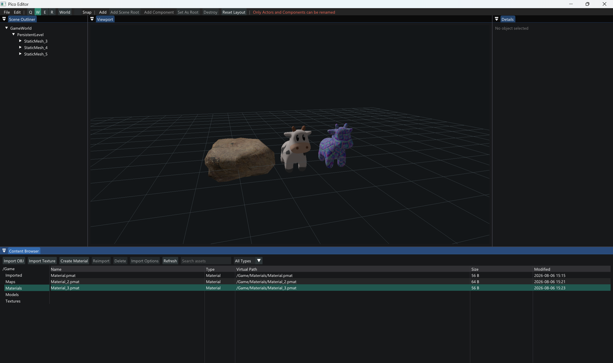

# Pico

[English](README.md) | [简体中文](README.zh-CN.md)

Pico 是一个以学习为目的、参考 Unreal Engine 架构设计的小型 C++ 3D 引擎。项目重点不是堆叠功能数量，
而是理解并亲手连接引擎启动、对象、反射、序列化、World、Actor、Component、Transform、编辑器和渲染等系统。

Pico 不以替代成熟商业引擎为目标。每个系统都会尽量保持小而清晰，同时保留可以完整运行和继续扩展的架构边界。



## 当前状态

前五个月的开发任务已经完成。目前 Pico 可以：

- 运行类似 UE 的 `PreInit -> Init -> Tick -> Exit` 引擎循环。
- 通过 `PClass` 和 `NewObject` 创建具有反射信息的原生 C++ 对象。
- 使用薄反射宏注册类和属性。
- 通过通用的元数据驱动界面查看和修改属性。
- 将反射对象序列化为 `.pobj`，并通过 `PostLoad` 完成加载后的处理。
- 将经过校验的 World 场景图原子保存为确定性的 `.pworld` 文件，并在不持久化运行时 Handle 的前提下事务式重建运行时 World。
- 事务式替换 `FEngineLoop` 的当前 World，并在文件加载或 `PostLoad` 失败时完整保留旧 World。
- 使用 `FObjectRegistry`、Outer 和带代数的 Handle 集中管理对象。
- 创建具有明确生命周期的 `PWorld`、`PLevel`、`PActor` 和 Component。
- 使用 RootComponent 为 Actor 提供 Transform。
- 建立 SceneComponent 父子挂接树并计算 Relative/World Transform。
- 通过 `.pico` 打开引擎目录之外的项目边界。
- 使用经过校验的 `/Game/...` 资产路径保存持久引用，不把本机磁盘路径写入对象或场景。
- 确定性扫描项目中的 `.pworld`、`.pmesh`、`.ptex` 和 `.pmat` 原生文件，并通过支持
  大小写不敏感查询和刷新的资产注册表提供元数据。
- 通过 TinyObjLoader 将三角化 OBJ 源数据导入经过校验且确定性的 `.pmesh`，保存位置、
  法线、UV、Section 和 Bounds。
- 通过 stb_image 将 PNG/JPG/TGA/BMP 导入经过校验的 RGBA8 `.ptex`，并创建包含 BaseColor、
  BaseColorTexture、Metallic 和 Roughness 的 `.pmat`。
- 为 StaticMeshComponent 分配可反射的 Material 引用，通过 Undo/Redo 编辑，并使用带纹理缓存和
  Mipmap 的 OpenGL 3.3 Cook-Torrance PBR 路径渲染。
- 缓存不可变 CPU Static Mesh 数据和渲染器私有的 OpenGL 网格，并在 Registry 元数据变化后刷新。
- 持久化 `PStaticMeshComponent` 资产引用，在编辑器视口中渲染、拾取、高亮和变换导入网格。
- 在可停靠的 Content Browser 中按目录、搜索文本和类型浏览项目资产，并支持 OBJ 导入、
  Registry 刷新以及基于项目内源文件元数据的重新导入。
- 导入前分析 OBJ 几何数据，选择自动或明确的源单位、预览最终尺寸，并通过 `Import Options`
  重新打开已持久化的设置。
- 批量删除混合选择的 Static Mesh、Texture 和 Material；删除前报告场景/资产依赖，可选删除
  项目内源文件，并支持场景事务清理与暂存回滚。
- 通过稳定的 `/Game/...` 路径选择和拖放 Static Mesh；创建或事务化分配网格时不再依赖
  Registry 的排列顺序。
- 将支持重新导入的用户源文件保存在 `Content/Source`；编辑器生成、供运行时直接读取的原生
  资产按类型放入 `Meshes`、`Textures`、`Materials` 和 `Maps` 等目录。
- 在 Outliner 和 Details 中查看、创建、修改和销毁运行时对象。
- 在 OpenGL 3.3 编辑器视口中渲染 `PCubeComponent`。
- 单选、追加选择、范围选择或使用 `Ctrl+A` 选择 Actor 和 Component，并在 Viewport 中
  高亮完整选择集。
- 通过编辑器事务撤销和重做场景层级、Actor Transform 与反射属性修改，并恢复完整多选集。
- 在一条命令中复制、粘贴和删除多个 Actor，或复制 SceneComponent 挂接子树；场景 ID
  会被重新映射，每条命令只生成一条事务记录。
- 通过基于 ImGuizmo 的 Viewport Gizmo 移动、旋转和缩放单个或多个场景对象，支持
  World/Local 坐标、吸附、主选择枢轴、取消操作和 Undo/Redo。
- 自由停靠编辑器面板，并将每个项目的布局保存到 `Saved/Editor`。
- 通过 `PicoRender` 私有的 GLAD 目标加载现代 OpenGL 函数。

Debug 和 Release 均可完整构建，八个 CTest 目标全部通过；`PicoEditorTests`
目前包含 69 项通过的检查。

## 架构

主要模块依赖方向为：

```text
PicoEditor
  -> PicoEditorCore
  -> PicoImGuizmo / PicoImGui
  -> PicoRender
  -> PicoEngine
  -> PicoAsset / PicoObject
  -> PicoCore
```

开发工具和示例只依赖运行时公开接口：

```text
PicoReflectionTools -> PicoObject
PicoAssetImport     -> PicoAsset / TinyObjLoader
PicoSandbox         -> PicoEngine / PicoObject
PicoInspector       -> PicoReflectionTools
```

| 模块 | 职责 |
| --- | --- |
| `PicoCore` | App状态、命令行、配置、日志、FName、路径、时间、数学和项目描述 |
| `PicoAsset` | 经过校验的虚拟资产发现、确定性项目注册表和文件元数据 |
| `PicoAssetImport` | 仅供开发阶段使用的 OBJ 到原生 Static Mesh 转换 |
| `PicoObject` | `PObject`、`PClass`、`PProperty`、反射、注册表、Handle、Outer和序列化 |
| `PicoEngine` | EngineLoop、World、Level、Actor、Component、挂接和可渲染场景数据 |
| `PicoRender` | 基于GLAD的OpenGL、Shader、几何体、Framebuffer、场景遍历和绘制提交 |
| `PicoEditorCore` | 不依赖 UI 的对象/资产选择、资产操作、命令、剪贴板、事务和 Transform 操作 |
| `PicoEditor` | Content Browser、资产工作流控制器与弹窗、Outliner、Details、编辑器相机、Viewport 拾取、工具状态和 Transform Gizmo UI |
| `PicoReflectionTools` | 通用元数据检查和反射属性工具 |
| `PicoSandbox` | 项目侧反射、序列化、资产和自动化测试示例 |

运行时模块不依赖 ImGui。`PicoCore`、`PicoAsset`、`PicoObject` 和 `PicoEngine` 也不依赖 GLFW 或 OpenGL。

## 运行时对象模型

Pico 明确区分四种关系：

```text
PClass       = 对象是什么类型
Outer        = 对象的命名和生命周期归谁管理
Handle       = 如何从注册表安全地重新找到对象
AttachParent = SceneComponent的Transform相对于谁
```

当前场景继承和组织主干为：

```text
PWorld
  -> PLevel
    -> PActor
      -> PActorComponent
        -> PSceneComponent
          -> PPrimitiveComponent
            -> PCubeComponent
```

对象内存由 `FObjectRegistry` 实际持有。Handle 不延长生命周期，失效 Handle 会解析为 `nullptr`。
Outer 负责命名关系和确定性的销毁顺序。这是未来追踪式垃圾回收的基础，但当前并不是追踪式 GC。

## 项目边界

Pico 将引擎安装内容与用户项目内容分开：

```text
EngineRoot/
  Source/
  ThirdParty/
  Config/

ProjectRoot/
  MyGame.pico
  Source/
  Content/
  Config/
  Intermediate/
  Saved/
```

编辑器和工具自动写入时，只允许写入项目的 `Content`、`Intermediate` 和 `Saved`。引擎源码和项目源码
不会成为自动写入目标。

`Projects/PicoSandbox/PicoSandbox.pico` 是仓库维护的示例项目。同样的项目结构也可以放在 Pico 仓库之外。

项目原生资产使用 `/Game/Maps/EditorWorld.pworld` 这样的虚拟标识。资产注册表把它映射到当前
项目 `Content` 下的文件；对象和场景持久化数据不会保存开发机器上的绝对路径。

## 环境要求

- Windows 10 或 Windows 11（x64）
- Visual Studio 2022，并安装 **使用 C++ 的桌面开发** 工作负载
- MSVC v143 和 Windows 10/11 SDK
- CMake 3.22 或更高版本
- Git for Windows
- 支持 OpenGL 3.3 的显卡和驱动

GLFW、Dear ImGui、ImGuizmo、TinyObjLoader 和 stb_image 已包含在 `ThirdParty` 中。

## 快速开始

```powershell
git clone https://github.com/zoroknight/Pico.git
Set-Location Pico
powershell -ExecutionPolicy Bypass -File .\Scripts\SetupWindows.ps1
```

初始化脚本会检查开发环境、生成 Visual Studio 2022 x64 工程、编译全部目标并运行测试。构建产物只写入 `Build`。

启动编辑器：

```powershell
.\Build\Debug\PicoEditor.exe .\Projects\PicoSandbox\PicoSandbox.pico
```

编辑器默认最大化，默认 UI 缩放为 `1.4`。需要更大的界面时可以指定：

```powershell
.\Build\Debug\PicoEditor.exe .\Projects\PicoSandbox\PicoSandbox.pico -uiscale=1.6
```

## 编辑器操作

编辑器启动后只有空场景：

```text
GameWorld
  -> PersistentLevel
```

- 使用 `Add > Empty Actor` 创建带有 `DefaultSceneRoot` 的编辑器 Actor。
- 使用 `Add > Cube` 创建以可渲染 `PCubeComponent` 直接作为根组件的 Actor。
- 在 Content Browser 中选择 `.pmesh`，再使用 `Add > Static Mesh` 或双击资产创建 Actor；
  `Ctrl` 可切换多选，`Shift` 可范围选择，`Ctrl+A` 会选择当前目录、搜索和类型过滤结果中的全部资产。
- 使用 `Import OBJ` 检查源模型，并选择 Auto、Centimeters、Meters、Millimeters、Normalize
  或 Custom 缩放；源文件会复制到 `Content/Source/Meshes`，原生 `.pmesh` 写入
  `Content/Meshes`。
- 使用 `Import Texture` 创建原生 `.ptex`，再通过 `Create Material` 编辑 BaseColor、
  BaseColorTexture、Metallic 和 Roughness；双击 `.pmat` 可以再次编辑。
  `Reimport` 沿用已保存设置，`Import Options` 可修改设置后重新构建。
- Content Browser 获得焦点时，按 `Delete` 或点击其 Delete 按钮可查看汇总的场景与资产引用，
  并批量移除选中的 Static Mesh、Texture 和 Material。删除项目内源文件是可选项；清理场景
  引用是一次支持 Undo/Redo 的事务，Material 到 Texture 的引用随暂存文件一起支持回滚，资产
  文件删除本身不进入场景事务。场景获得焦点时，`Delete` 仍删除场景对象。
- 可将 Static Mesh 拖到 Details 的 `AssetPath`，也可使用 `Use Selected` 和 `Clear`。
  分配和清除支持场景 Undo/Redo，导入和重导入不进入场景事务。
- 可以向选中的 Actor 添加 Scene 或 Cube Component，也可以向选中的 SceneComponent 添加子组件。
- 按 `F2` 重命名 Actor 或 Component，按 `Delete` 删除；删除 SceneComponent 会删除完整的附着子树。
- 右键 World、Level、Actor 或 Component 节点可执行对应的创建、重命名、设置根组件和删除操作。
- 左键点击 Viewport 中的可见几何体会选中它所属的 Actor；选中 Actor 时会给它的全部可见
  CubeComponent 绘制白框，在 Outliner 中选择组件时只给该组件绘制白框。
- 按住 `Ctrl` 点击可以切换对象的选择状态；在 Outliner 中按住 `Shift` 可以范围选择，
  `Ctrl+A` 会选择所有场景 Actor。
- `Q` 为选择模式，`W` 为平移，`E` 为旋转，`R` 为缩放；工具栏提供相同入口。
- 按 `F` 根据选中 Actor 或组件变换后的世界 Bounds 聚焦；相机距离、近裁剪面和移动速度会
  同时适配非常小和非常大的网格。
- `World` 使 Gizmo 与场景坐标轴对齐，`Local` 使 Gizmo 与主选择对象的旋转对齐；多选
  旋转和缩放以主选择对象为枢轴。
- 开启 `Snap` 可以吸附平移、旋转和缩放；拖动过程中按 `Esc` 会将所有目标恢复到拖动前。
- Actor Gizmo 使用 RootComponent 作为 Actor 枢轴。如果可见几何体相对
  `DefaultSceneRoot` 存在偏移，应在 Outliner 中选择子组件，以它自身的原点进行变换。
- 使用 `Ctrl+Z` 撤销，使用 `Ctrl+Y` 或 `Ctrl+Shift+Z` 重做场景层级、Actor Transform 和
  反射属性修改；一次连续拖动只会生成一条事务记录。
- 使用 `Ctrl+C` 和 `Ctrl+V` 复制粘贴 Actor 及其全部组件，或选中的 SceneComponent
  及其完整挂接子树；一次粘贴对应一条可撤销事务。
- 在 Details 中修改 Actor Transform，可以移动、旋转和缩放 Cube。
- 修改 `CubeComponent` 的反射属性，可以调整相对 Transform、Extent、Color 和可见性。
- 在 Viewport 中按住鼠标右键会捕获光标，移动鼠标可以稳定地转动视角。
- 按住鼠标右键时使用 `W/A/S/D` 飞行，使用 `Q/E` 下降或上升。
- 按住 `Shift` 可获得四倍速度，飞行时滚动鼠标滚轮可调整相机速度。
- 使用工具栏，可以创建 Actor、增加场景子组件、设置 Root 或销毁运行时对象。
- 拖动面板标签可以重新停靠或合并面板，使用 `Reset Layout` 恢复默认布局。

使用 `Ctrl+S` 可以将场景保存到当前项目的 `Content/Maps/EditorWorld.pworld`，使用 `Ctrl+O`
可以重新加载。保存场景数据不会重写 C++ 源码。

编辑器面板布局与场景数据相互独立，布局保存在
`Projects/<ProjectName>/Saved/Editor/PicoEditorLayout.ini`。

## 程序和示例

| 目标 | 用途 |
| --- | --- |
| `PicoLaunch` | 无窗口的 EngineLoop 和 World 生命周期程序 |
| `PicoEditor` | 带有 OpenGL 场景视口的运行时编辑器 |
| `PicoInspector` | 通用反射对象检查器 |
| `PicoReflectionDemo` | 控制台反射流程演示 |
| `PicoAssetTool` | 开发阶段使用的 OBJ 到 `.pmesh` 命令行导入器 |
| `PicoSandboxDemo` | 项目侧创建、修改、保存、销毁和加载完整流程 |

运行示例：

```powershell
.\Build\Debug\PicoLaunch.exe -frames=5
.\Build\Debug\PicoReflectionDemo.exe
.\Build\Debug\PicoAssetTool.exe import-obj source.obj destination.pmesh
.\Build\Debug\PicoInspector.exe
.\Build\Projects\PicoSandbox\Debug\PicoSandboxDemo.exe
.\Build\Debug\PicoEditor.exe .\Projects\PicoSandbox\PicoSandbox.pico
```

## 构建与测试

手动生成、构建和测试：

```powershell
cmake -S . -B Build -G "Visual Studio 17 2022" -A x64
cmake --build Build --config Debug --parallel
ctest --test-dir Build -C Debug --output-on-failure
```

构建和测试 Release：

```powershell
powershell -ExecutionPolicy Bypass -File .\Scripts\SetupWindows.ps1 -Configuration Release
```

在 Visual Studio 中打开 Pico：

```text
Scripts\OpenFolder.bat
Scripts\GenerateProjectFiles.bat
Scripts\OpenSolution.bat
```

生成的解决方案位于 `Build\Pico.sln`。

## 仓库结构

```text
Pico/
  Config/                  引擎配置
  Docs/                    里程碑与开发说明
  Projects/PicoSandbox/    仓库维护的外部项目式示例
  Scripts/                 Windows初始化和构建脚本
  Source/
    Developer/             仅开发期使用的反射工具
    Editor/                PicoEditor和PicoInspector
    Runtime/               Core、Object、Engine、Render和Launch
    Samples/               可复用的引擎侧示例
  Tests/                   Core、Object、Engine和Sandbox测试
  ThirdParty/              GLAD、GLFW、Dear ImGui和ImGuizmo
```

## 编写反射类

Pico 当前使用薄原生 C++ 宏：

```cpp
class PExample final : public Pico::PObject
{
    PICO_DECLARE_CLASS(PExample, Pico::PObject)

private:
    Pico::int32 Health = 100;
};
```

在 `.cpp` 中显式定义类和反射属性：

```cpp
PICO_DEFINE_CLASS(PExample)

bool PExample::RegisterProperties(Pico::PClass& Class)
{
    std::vector<Pico::PProperty> Properties;
    PICO_ADD_PROPERTY(Properties, Health);
    return Class.AddProperties(std::move(Properties));
}
```

Pico 目前还没有类似 UHT 的头文件工具。未来的 PicoHeaderTool 可以生成这些样板代码，同时继续使用同一套运行时元数据系统。

相关文档：

- [反射类编写指南](Docs/ReflectionAuthoringGuide.md)
- [PicoSandbox指南](Projects/PicoSandbox/README.md)
- [第三个月编辑器视口](Docs/Month03_10_Editor3DViewport.md)
- [第三个月编辑器停靠布局](Docs/Month03_11_EditorDocking.md)
- [第三个月GLAD集成](Docs/Month03_12_GLADIntegration.md)
- [第四个月编辑器事务](Docs/Month04_9_EditorTransactions.md)
- [第四个月属性事务](Docs/Month04_10_EditorPropertyTransactions.md)
- [第四个月编辑器剪贴板](Docs/Month04_11_EditorClipboard.md)

## 路线图

第五个月的重点是将持久化场景编辑器发展为资产驱动的 3D 工作流：

- 项目级 Asset Registry 和 Content Browser
- Static Mesh 资产格式、模型导入和稳定的场景资产引用
- 编辑器内的资产创建、检查、分配、保存/加载和重新导入流程
- Render Scene 缓存，以及精简的材质、贴图和 PBR 路径
- 完成一个重启编辑器后仍可恢复、并可继续进入打包阶段的端到端场景

更后面的阶段计划探索：

- 追踪式垃圾回收
- 委托和事件
- Replication和RPC
- 物理与动画集成
- 打包和项目代码生成
- 光线追踪
- 核心引擎成熟后实现精简版Gameplay Ability System

详细里程碑记录位于 [`Docs`](Docs)。
