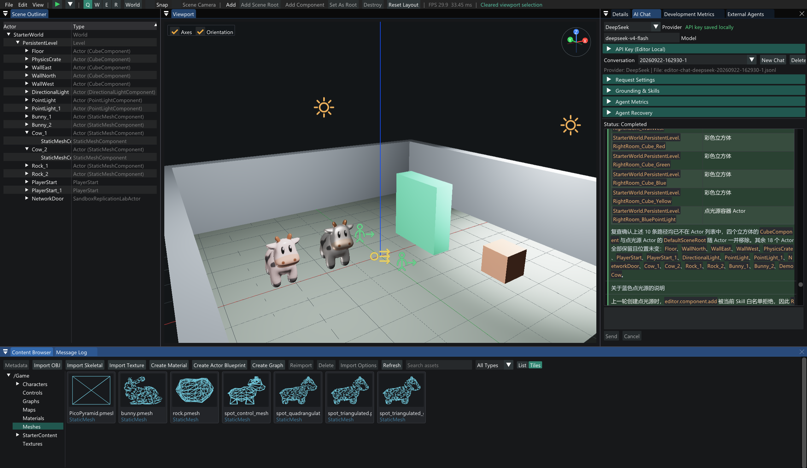

# Pico

[English](README.md) | [简体中文](README.zh-CN.md)

Pico 是一个以学习为目的、参考 Unreal Engine 架构设计的小型 C++ 3D 引擎。项目重点不是堆叠功能数量，
而是理解并亲手连接引擎启动、对象、反射、序列化、World、Actor、Component、Transform、编辑器和渲染等系统。

Pico 不以替代成熟商业引擎为目标。每个系统都会尽量保持小而清晰，同时保留可以完整运行和继续扩展的架构边界。



## 当前状态

当前实现可以：

- 通过独立 `PicoTasks` 固定 Worker Pool 执行可取消的纯数据后台任务，并在 `BeforeWorldTick` 由带帧预算的
  Game Thread Dispatcher 安全应用结果；关闭编辑器时停止接收任务、请求取消并等待 Worker 退出。
- 通过不依赖 Editor/World/UI 的 `PicoAgentCore` 运行确定性 Agent 流程：Provider 与 Tool Executor 可替换，
  状态迁移受校验，修复和步骤有预算，支持协作取消、追加式 JSONL Session、Checkpoint、重启恢复和
  ToolCall ID 幂等。
- Agent 工具执行固定经过 JSON Schema、权限、审批、现有 World Snapshot 事务、后置验证和回滚；阶段 Trace
  写入 Session，CallId 不能换参数复用授权，Agent 创建的 Actor 可直接进入编辑器原有 Undo 历史。
- Agent 每次运行复用 Run/Turn/Model/Approval/Tool/Validation Span，向 Session 旁持久化版本化 Metrics，统一记录
  调用数、阶段延迟、上下文字节、Repair、Cache Hit、权限拒绝、失败分类和 Completion Rate，供 Golden Task
  与后续 CI 使用，不从聊天文本猜测成功与否。
- Agent 可通过通用工具发现 Actor/Component 的 `PProperty`、当前值和语义元数据，并在一次审批与 Undo 事务中
  批量修改支持的 `Editable` 属性；新增普通反射属性不需要再手写专用工具。
- AI Chat 支持按 Provider 隔离的多会话、新建/删除、重启恢复、自动定位最新消息、气泡复制，以及基于 MD4C 的
  Markdown/JSON 代码块和 GFM 表格显示；代码块可展开但不会抢占外层聊天记录的滚轮，编辑器字体合并常用
  Symbol/Dingbats 字形以正确显示对号、箭头等符号。
- DeepSeek/Kimi 支持 SSE 流式文字与 Tool Call 聚合；最终消息只写入 Session 一次。项目 Knowledge Store 以
  快照和追加审计记录 World、资产、反射、项目文档及错误，RAG Lite 按预算注入带来源的证据；版本化 Pico Skill
  同时裁剪 Provider 工具和执行权限，不会绕过审批、事务或验证。
- Agent Intent Router 与生产 Skill 使用 18 条中英文固定提示回归，覆盖否定语义和多 Skill 组合；后续 GAS、
  PicoGraph 与 ECS 工具必须扩展同一评测集。
- 场景 Agent 可搜索真实资产、创建碰撞房间、放置或删除 Data-Only Actor Blueprint 实例、装配第三人称角色、
  校验并保存 World，并通过独立的 `editor.play.start/stop` 启停游戏。运行与打包使用不同工具和硬意图检查，
  “运行项目”不会误调用 Packager。
- Agent 创建内容型项目后会在当前结果落盘后执行受控编辑器进程交接，并在新项目恢复 Provider、模型和同一聊天
  Session；API Key 保存在被 Git 忽略的编辑器本地目录，所有项目共享且不会暴露给 Agent 工具。Harness 使用
  StateRevision 语义缓存、结构化 Progress Ledger、分类预算
  和连续无进展检测约束重复查询。
- 可选择在 AI Chat 中开启本地 MCP Streamable HTTP Server；它默认关闭且只绑定 `127.0.0.1`，验证
  Host、Origin 和 Git 忽略的独立 Bearer Token，外部客户端默认只看到三个 Toolset 元工具。MCP 调用继续复用
  内置聊天相同的审批、事务、验证、取消与 Game Thread 执行边界。
- 运行类似 UE 的 `PreInit -> Init -> Tick -> Exit` 引擎循环。
- 通过位于 `PicoCore` 的低开销 CPU Profiler 记录 Frame/Thread/Parent Scope，导出 Chrome Trace 和聚合 JSON；
  独立 `PicoRuntimeBenchmarks` 以 Quick/Full 两档测量真实 Object、Tick、GC 和 Replication 路径并输出版本化
  JSON/CSV，本阶段先建立证据，不提前修改被测算法。
- 通过[性能优化总览与追踪记录](Docs/Pico_Performance_Optimization_Log.zh-CN.md)持续记录性能瓶颈、发现依据、
  优化方法、优化前后 Release 数据、额外代价和后续决定。
- 通过固定 Tag 的轻量 `PicoMemoryTracker` 记录 Object、GC、Profiler 和 Replication 的 Current、Reserved、
  Peak、Element 与 Growth；Runtime Benchmark v3 将七类结构内存输出为 JSON 和独立 CSV。
- 通过独立 `PicoNetCore` 使用确定性 Loopback 或非阻塞 Windows UDP 连接一个服务器和多个客户端，提供版本化
  Packet、握手、Sequence/Ack、有界且有序的可靠交付、心跳、超时，以及 World 前后 NetDriver 阶段。
- 通过每连接 ActorChannel、服务器分配的 NetObjectId、稳定反射 Schema 和确认属性基线复制显式启用的 Actor，
  支持 Spawn/Delta/Destroy、Transform、InitialOnly、零参数 OnRep 和带类型检查的延迟 Actor 引用修复。
- 所有 Actor 派生类型都可在反射 Details 中配置 `Replicates` 与 `Replicate Movement`；普通 Actor 可发送服务器
  权威的不可靠根移动快照，动态根刚体同步位置、线速度、角速度和激活状态；客户端 Dynamic Network Physics
  Proxy 在快照间提供短时本地预测，服务器快照覆盖误差。Character 继续使用独立的预测、纠错和重演链路。
- Details 与通用 Agent 属性工具可配置精简 UE 风格 Collision Profile，包括 `Pawn`、`Pawn (Ignore Pawns)`、
  `Physics Actor`、`Trigger` 和 `Projectile`。Pico 在稳定的 Jolt Moving/NonMoving BroadPhase 之上解析双方
  Ignore/Overlap/Block；联机玩家胶囊默认互相阻挡但不推动，最终结果仍由服务器权威重演和纠错。
- QueryOnly Blocking Body 与显式 Trigger Sensor 已在 Jolt 查询中过滤分离；Character 胶囊保留 Sweep 阻挡但不建立
  刚体 Contact；`Enable Physics Interaction` 的最终推动结果由服务器 Authority 决定，本地 AutonomousProxy 预测
  即时反馈，而 SimulatedProxy 不得推动观察端箱子。
- 通过有界 SavedMove 冗余、Ownership 与控制策略校验实现服务器权威角色移动，自主代理可预测、纠错并重演；
  模拟代理支持 Disabled、Linear、Exponential 与 Snapshot Interpolation 四种网络平滑模式，并按 UE5 思路在快照间
  进行有上限的碰撞感知外推、只对 Mesh 消除视觉跳变；服务器时间与快照抖动驱动 25～100 ms 动态平滑，Play
  网络模拟以目标 RTT 表示延迟，F1 可观察 Move RTT、Snapshot Transit 和 Clock Offset。低延迟三窗口验收见
  [`Docs/Month09_4_5_LowLatencyVisualAcceptance.zh-CN.md`](Docs/Month09_4_5_LowLatencyVisualAcceptance.zh-CN.md)。
- PicoSandbox 的 `NetworkDoor` 是保存在 `StarterWorld.pworld` 中的场景 Actor：服务器从地图加载权威实例，两个
  客户端通过 ActorChannel 获得对应网络实例；开关状态、位移与碰撞结果会同步收敛。
- 同一次 Windows Development Stage 已在两台真实 Windows 电脑上完成局域网验收：电脑 A 同时运行独立服务器与
  客户端 1，电脑 B 运行客户端 2，双方移动、跳跃和 Gameplay RPC 可通过 UDP 权威链路同步。
- 编辑器 Play 下拉菜单可在 Standalone 与“可视化独立服务器 + 1～4 个客户端”之间切换，持久化端口和窗口
  尺寸，并以独立标题、日志和进程句柄启动、监控及统一停止整组 Play Session。
- Windows UDP Transport 针对自身 Socket 关闭 `SIO_UDP_CONNRESET`，并将启动竞态产生的 Winsock `10054`
  视为可重试的暂时无数据；其他程序和系统网络设置不受影响，连接失败仍由握手超时判定。
- 启动独立的 `PicoGame` Runtime，提供逐帧输入、可配置的 Action/Axis 映射，并支持项目默认地图或命令行地图覆盖。
- 构建项目专属的 `PicoSandboxGame` Runtime：静态链接的 Game Module 在地图加载前注册项目原生类型，随后创建项目 GameInstance。
- 生成可反射的项目 Character，通过正常的 World/Actor Tick 消费 WASD 与 Jump 映射输入。
- 通过确定性输入与状态驱动胶囊体行走、跳跃、下落、落地、沿墙滑动和推动动态刚体，为后续客户端预测保留重演边界。
- Jolt 使用固定 60 Hz、每个 World 帧最多四个子步，所有后端类型仍隔离在 `PicoPhysicsCore` 接口之后。
- 通过原生 Skeleton、SkeletalMesh、AnimationClip、AnimInstance、Pose 与 CPU 蒙皮播放移动状态驱动的
  Idle/Walk/Jump，Root Motion 仍经 Sweep/MoveComponent 执行。
- 通过 `.panimset` 统一引用 Skeleton 与 Idle/Walk/Jump，并以 `.pmontage`、单 Slot、Segment、Section、
  Notify/NotifyWindow、淡入淡出和完成/中断委托实现 Montage Lite；Montage Root Motion 仍走角色移动碰撞链。
- Skeletal Preview 的 Montage Lab 可直接播放、停止、跳转 Section，并观察时间、Notify 和结束原因；
  SkeletalMeshComponent 提供八个可编辑材质槽，并根据骨骼网格实际 Section 数标记未使用槽位。
- 在独立运行时的 `Gameplay Debug` 中分别查看地面速度、动画状态、移动模式、当前 Clip 和播放时间，
  因而可以明确区分“零速度时播放 Idle”和“角色仍处于地面 Walking 移动模式”。
- 从 Content Browser 导入 glTF/GLB 或 FBX，先在独立临时 Preview World 中检查参考姿势、动画、时间轴
  和镜头，再由编辑器自动生成项目原生资产、内部 `/Game` 引用并刷新 AssetRegistry，无需手动复制文件。
- glTF 导入会在独立 AssetImport 层转换 PBR 材质、嵌入/外部贴图和多材质 Section，生成 `.pmat/.ptex`；
  `.pskeletalmesh` 保存默认槽材质，运行时仍可由组件按槽覆盖。
- `Edit -> Project Settings` 可视化编辑 Action/Axis、鼠标灵敏度、默认地图、Pawn、PlayerController 和
  默认 Character Profile；`Add -> Actor Class...` 可搜索项目原生 Actor 类。
- 通过独立的 Components/Preview/Details 窗口创建和编辑 `.pblueprint` Data-Only Actor 类型，将 Actor
  与原生组件的反射属性覆盖编译为生成 `PClass`、CDO 和默认子对象模板，并在关卡中放置和持久化该类型。
- Actor Blueprint 使用编辑器同进程的独立系统窗口；其预览提供带箭头的局部 XYZ 轴，主编辑器视口提供
  可关闭的世界原点轴线与右上角方向控件，并支持按住方向控件拖动视角。
- 无参数启动时进入项目浏览器，支持最近项目、选择 `.pico` 或只包含一个描述符的项目文件夹，并按项目
  恢复最后打开的 World、Actor Blueprint 和 Skeletal Preview。
- 将骨骼模型最终变换拆为 Actor World、Component Relative 和 Character Profile Visual 三层，使源模型
  朝向修正不再改变碰撞、移动参考系或未来需要同步的角色朝向。
- 按 UE 第三人称模板拆分旋转职责：`DoMove` 以 ControlRotation Yaw 生成世界 Forward/Right 输入，
  CharacterMovement 让 Actor 朝移动方向转身，SpringArm 独立计算 Camera TargetRotation，不再把
  ControlRotation 写入相对 Transform；固定鼠标按 S 时角色转身而镜头 Yaw 保持不变。
- 将已经调优的行为保存为 Actor Blueprint 引用的可复用 `.pcontrolprofile`；共享移动方向函数、稳定策略
  Hash、F1 身份诊断和 0/90 度黄金测试保证未来本地预测与服务器重演使用同一套控制语义。
- Controller 提供可反射的俯仰角上下限，Sandbox 默认限制为 `-75` 到 `+55` 度；SpringArm 参考 UE 的
  球形 Sweep 在墙壁、地板或天花板前回缩，并可通过 `Do Collision Test` 和 `Probe Size` 独立配置。
- 编辑器顶部及 Runtime 状态窗口可显示平滑后的 FPS 与帧耗时。VSync、Software MaxFPS 与 Unlimited
  互斥，完整帧结束后才执行软件等待，避免 VSync 与 MaxFPS 重复限帧；Editor、Game 与打包 EXE 使用
  Windows GUI 子系统，默认不显示控制台。编辑器日志保存到 `Saved/Logs`，需要调试时可用 `-console` 或
  `-log` 临时打开控制台。
- 每次骨骼导入自动生成 `.pcharprofile`，集中引用 Mesh、AnimationSet、Montage 与材质槽；项目可切换
  Profile 而无需修改 Pawn CDO。覆盖重导入会先备份旧资产，失败时整批恢复。
- 编辑器可从项目 Pawn 类和 Character Profile 创建持久化可玩角色；运行时优先 Possess 地图中标记为
  `Auto Possess Player 0` 的 Pawn，仅在地图没有可用 Pawn 时才使用项目默认类和 Profile 生成角色。
- Controller 通过 ControlRotation、鼠标捕获和 SpringArm 驱动第三人称相机；WASD 使用相机朝向计算移动，
  角色可随移动方向转身。组件材质覆盖优先于 Character Profile，Profile 又优先于导入网格默认材质。
- PicoSandbox 默认打开持久化 `StarterWorld.pworld`，其中包含可复用的立方体网格/PBR 材质、地面、
  三面墙、动态箱子、PlayerStart、方向光和点光；这些内容属于地图资产，不依赖 GameMode 临时生成。
- 通过 `PClass` 和 `NewObject` 创建具有反射信息的原生 C++ 对象。
- 为每个已注册类创建 CDO，通过继承的默认子对象模板声明固定对象图，并由统一构造链生成彼此独立的运行时实例。
- 使用类型安全的 Native 单播与多播委托，通过带代数 Handle 弱绑定对象，并广播 Actor 生成和销毁事件。
- 使用动态多播委托按“弱对象Handle + PFunction名称”绑定Callable函数，校验签名并经ProcessEvent广播。
- 在 `.pworld` 中按场景ID、对象路径和函数名持久化反射动态多播属性，并在新对象图创建后修复绑定。
- 反射属性写入统一产生前后通知，区分ValueSet、Interactive、Load和UndoRedo；修改CDO只影响未来实例。
- 完成 UE 风格本地 Gameplay Framework：GameInstance/LocalPlayer 跨地图保留，GameMode 完成
  Login、RestartPlayer 和 MatchState 决策，GameState 保存比赛状态、时间和 PlayerState 列表。
- 通过 Controller 和 GameMode 的 Native 生命周期委托观察 Possess、UnPossess、登录、登出和比赛状态变化。
- 在正式编辑器 Details 的 `Events & Bindings` 中配置签名匹配的动态委托，支持 Undo/Redo、Dirty
  和 `.pworld` 保存加载；Gameplay Debug 可显示状态、绑定数和广播计数。
- 使用 `PCLASS`、`PPROPERTY` 和 `PFUNCTION` 在原生 C++ 声明旁标记反射内容，并由
  PicoHeaderTool 在编译前生成重复的注册代码。
- 通过 `PObject::ProcessEvent` 调用反射 Native 函数，支持类型化参数/返回值元数据、继承查找、
  生命周期校验以及供未来 RPC 使用的合法 Flags。
- 通过通用的元数据驱动界面查看和修改属性。
- 使用无需项目的 PicoInspector Developer Sandbox，通过自动生成的参数控件调用反射函数，并可视化
  验证 Native Delegate、GC 可达性、请求合并、安全点调度和对象 Handle 失效。
- 将反射对象序列化为 `.pobj`，并通过 `PostLoad` 完成加载后的处理。
- 将经过校验的 World 场景图原子保存为确定性的 `.pworld` 文件，并在不持久化运行时 Handle 的前提下事务式重建运行时 World。
- 事务式替换 `FEngineLoop` 的当前 World，并在文件加载或 `PostLoad` 失败时完整保留旧 World。
- 将编辑器 World 作为文档管理，支持 New、Open、Save、Save As、稳定的 `/Game/...` 身份、Dirty 状态以及保存/放弃/取消保护。
- 使用 `FObjectRegistry`、Outer 和带代数的 Handle 集中管理对象。
- 通过 Root Set、反射强弱对象引用、Outer 和原生 `AddReferencedObjects` 执行 Stop-the-world
  Mark-Sweep，回收不可达的运行时对象图。
- 创建具有明确生命周期的 `PWorld`、`PLevel`、`PActor` 和 Component。
- 使用 RootComponent 为 Actor 提供 Transform。
- 建立 SceneComponent 父子挂接树并计算 Relative/World Transform。
- 将 SceneComponent 挂到父组件的命名 Socket，在 `.pworld` v3 中保存 Socket 关系，并兼容
  没有 Socket 数据的 v1/v2 场景。
- 通过统一的反射、序列化、层级和编辑器事务创建 Camera、Spring Arm、Directional Light
  和 Point Light 运行时组件。
- 通过 `.pico` 打开引擎目录之外的项目边界。
- 通过经过校验的 Engine/Stage 标记、相对路径和版本信息区分 Development、Installed、Staged，
  并支持严格的 `-engineroot`、`-stageroot` 显式覆盖，不再要求打包目录携带源码树。
- Release Sandbox 已通过仓库外 Stage 探针：不携带 `Source`、`CMakeLists.txt`、仓库工作目录或显式项目参数，
  仍能由 Manifest 定位 Engine、项目和资产并正常运行。
- 可以通过独立 `PicoPackager` 或编辑器 File 菜单生成原子替换的 Windows Development Stage；Target Receipt、
  原生资产 Contributor、校验、文件报告和可选的仓库外冒烟测试共同组成第一版打包链路。
- `PicoEditor` 构建目标显式依赖 `PicoPackager`，单独构建 Release 编辑器也会在同一 Binaries 目录生成打包器，
  避免编辑器入口因遗漏工具目标而失效。
- 打包窗口支持自定义 Package Name 和显式 `Replace Package`：稳定名称用于更新已有包，自定义名称用于并列输出；
  唯一内部 Stage 工作目录会在成功或失败后清理，失败不会破坏上一次可用包。
- 使用经过校验的 `/Game/...` 资产路径保存持久引用，不把本机磁盘路径写入对象或场景。
- 确定性扫描项目中的 `.pworld`、`.pmesh`、`.ptex` 和 `.pmat` 原生文件，并通过支持
  大小写不敏感查询和刷新的资产注册表提供元数据。
- 通过 TinyObjLoader 将三角化 OBJ 源数据导入经过校验且确定性的 `.pmesh`，保存位置、
  法线、UV、Section 和 Bounds。
- 通过 stb_image 将 PNG/JPG/TGA/BMP 导入经过校验的 RGBA8 `.ptex`，并创建包含 BaseColor、
  BaseColorTexture、Metallic 和 Roughness 的 `.pmat`。
- 为 StaticMeshComponent 分配可反射的 Material 引用，通过 Undo/Redo 编辑，并使用带纹理缓存和
  Mipmap 的 OpenGL 3.3 Cook-Torrance PBR 路径渲染。
- 缓存不可变 CPU Static Mesh 数据和渲染器私有的 OpenGL 网格，并在 Registry 元数据变化后刷新。
- 持久化 `PStaticMeshComponent` 资产引用，在编辑器视口中渲染、拾取、高亮和变换导入网格。
- 在可停靠的 Content Browser 中按目录、搜索文本和类型浏览项目资产，并支持 OBJ 导入、
  Registry 刷新以及基于项目内源文件元数据的重新导入。
- 导入前分析 OBJ 几何数据，选择自动或明确的源单位、预览最终尺寸，并通过 `Import Options`
  重新打开已持久化的设置。
- 批量删除混合选择的 Static Mesh、Texture 和 Material；删除前报告场景/资产依赖，可选删除
  项目内源文件，并支持场景事务清理与暂存回滚。
- 通过稳定的 `/Game/...` 路径选择和拖放 Static Mesh；创建或事务化分配网格时不再依赖
  Registry 的排列顺序。
- 将支持重新导入的用户源文件保存在 `Content/Source`；编辑器生成、供运行时直接读取的原生
  资产按类型放入 `Meshes`、`Textures`、`Materials` 和 `Maps` 等目录。
- 在 Outliner 和 Details 中查看、创建、修改和销毁运行时对象。
- 在 OpenGL 3.3 编辑器视口中渲染 `PCubeComponent`。
- 在编辑器中预览第一个激活的场景 Camera，包括挂在 Spring Arm 的 `SpringEndpoint` 上的 Camera。
- 为无实体组件绘制可拾取的编辑器线框：Camera 视锥、Directional Light 箭头、Point Light
  小型图标与仅选中时显示的衰减范围球，以及 Spring Arm 末端连线。
- 使用场景中的一个 Directional Light 和最多四个 Point Light 进行 PBR 光照；没有创建
  Light 组件的旧场景继续使用兼容的默认方向光。
- 单选、追加选择、范围选择或使用 `Ctrl+A` 选择 Actor 和 Component，并在 Viewport 中
  高亮完整选择集。
- 通过编辑器事务撤销和重做场景层级、Actor Transform 与反射属性修改，并恢复完整多选集。
- 在一条命令中复制、粘贴和删除多个 Actor，或复制 SceneComponent 挂接子树；场景 ID
  会被重新映射，每条命令只生成一条事务记录。
- 通过基于 ImGuizmo 的 Viewport Gizmo 移动、旋转和缩放单个或多个场景对象，支持
  World/Local 坐标、吸附、主选择枢轴、取消操作和 Undo/Redo。
- 自由停靠编辑器面板，并将每个项目的布局保存到 `Saved/Editor`。
- 通过 `PicoRender` 私有的 GLAD 目标加载现代 OpenGL 函数。

Debug 和 Release 均可完整构建，十九个 CTest 目标全部通过；动画聚焦测试为 13/13 断言通过。

## 架构

主要模块依赖方向为：

```text
PicoEditor
  -> PicoEditorCore
  -> PicoImGuizmo / PicoImGui
  -> PicoRender
  -> PicoEngine
  -> PicoAsset / PicoObject
  -> PicoCore
```

开发工具和示例只依赖运行时公开接口：

```text
PicoReflectionTools -> PicoObject
PicoHeaderTool      -> 生成的反射 C++
PicoAssetImport     -> PicoAsset / TinyObjLoader
PicoInspector       -> PicoReflectionTools

PicoSandboxGame
  -> PicoSandboxModule
  -> PicoGameRuntime
  -> PicoEngine / PicoInput / PicoRender
```

| 模块 | 职责 |
| --- | --- |
| `PicoCore` | App状态、命令行、配置、日志、FName、路径、时间、数学和项目描述 |
| `PicoTasks` | 固定 Worker Pool、任务状态、协作取消、异常隔离和带帧预算的 Game Thread Dispatcher |
| `PicoAgentCore` | Provider/Runtime 边界、Agent 状态机、预算、追加式 Session、Checkpoint、恢复和 ToolCall 幂等 |
| `PicoInput` | 逐帧按键与指针状态，以及可配置的 Action/Axis 映射 |
| `PicoNetCore` | 网络地址与身份、Packet 编解码、确定性 Loopback、非阻塞 UDP、握手、Ack、有界可靠交付、心跳和超时 |
| `PicoAsset` | 经过校验的虚拟资产发现、确定性项目注册表和文件元数据 |
| `PicoAssetImport` | 仅供开发阶段使用的 OBJ 到原生 Static Mesh 转换 |
| `PicoObject` | 对象模型、反射、委托、强弱引用、Root Set、Mark-Sweep GC、注册表、Handle、Outer 和序列化 |
| `PicoPhysicsCore` | 后端无关的 Shape、Body Handle、查询、命中结果和 PhysicsScene 接口 |
| `PicoPhysicsJolt` | Jolt 5.6.0 Shape/Body、固定步模拟、查询、接触事件和单位转换适配层 |
| `PicoEngine` | EngineLoop、World、Level、Actor、Component、挂接和可渲染场景数据 |
| `PicoRender` | 基于GLAD的OpenGL、Shader、几何体、Framebuffer、场景遍历和绘制提交 |
| `PicoGameRuntime` | 可复用的项目启动、GLFW 窗口、输入轮询、逐帧循环和运行时渲染 |
| `PicoEditorCore` | 不依赖 UI 的 World 文档、对象/资产选择、资产操作、命令、剪贴板、事务和 Transform 操作 |
| `PicoEditor` | World 文件对话框、Content Browser、资产工作流控制器、Outliner、Details、编辑器相机、Viewport 拾取、工具状态和 Transform Gizmo UI |
| `PicoReflectionTools` | 通用元数据检查和反射属性工具 |
| `PicoHeaderTool` | 解析受约束原生反射标记并在构建期生成注册代码的 Token 工具 |
| `PicoSandboxModule` | 项目类、Game Module 启动、GameInstance 创建、反射、序列化和自动化测试 |

运行时模块不依赖 ImGui。`PicoCore`、`PicoAsset`、`PicoObject` 和 `PicoEngine` 也不依赖 GLFW 或 OpenGL。

## 运行时对象模型

Pico 明确区分四种关系：

```text
PClass       = 对象是什么类型
Outer        = 对象的命名和生命周期归谁管理
Handle       = 如何从注册表安全地重新找到对象
AttachParent = SceneComponent的Transform相对于谁
```

当前场景继承和组织主干为：

```text
PWorld
  -> PLevel
    -> PActor
      -> PActorComponent
        -> PSceneComponent
          -> PCameraComponent
          -> PSpringArmComponent
          -> PLightComponent
            -> PDirectionalLightComponent
            -> PPointLightComponent
          -> PPrimitiveComponent
            -> PCubeComponent
            -> PStaticMeshComponent
```

对象内存由 `FObjectRegistry` 实际持有。Handle 不延长生命周期，失效 Handle 会解析为 `nullptr`。
Outer 负责命名关系、确定性销毁顺序和子对象到父对象的 GC 引用。Root Set、反射强引用和原生引用
上报共同驱动 Stop-the-world Mark-Sweep；弱引用不会阻止目标回收。GC 请求由 EngineLoop 在 World Tick
之后的安全点消费，并支持定时、World 切换和引擎退出触发。

## 项目边界

Pico 将引擎安装内容与用户项目内容分开：

```text
EngineRoot/
  Source/
  ThirdParty/
  Config/

ProjectRoot/
  MyGame.pico
  Source/
  Content/
  Config/
  Intermediate/
  Saved/
```

编辑器和工具自动写入时，只允许写入项目的 `Content`、`Intermediate` 和 `Saved`。引擎源码和项目源码
不会成为自动写入目标。

`Projects/PicoSandbox/PicoSandbox.pico` 是仓库维护的示例项目。同样的项目结构也可以放在 Pico 仓库之外。

项目原生资产使用 `/Game/Maps/EditorWorld.pworld` 这样的虚拟标识。资产注册表把它映射到当前
项目 `Content` 下的文件；对象和场景持久化数据不会保存开发机器上的绝对路径。

## 环境要求

- Windows 10 或 Windows 11（x64）
- Visual Studio 2022，并安装 **使用 C++ 的桌面开发** 工作负载
- MSVC v143 和 Windows 10/11 SDK
- CMake 3.22 或更高版本
- Git for Windows
- 支持 OpenGL 3.3 的显卡和驱动

GLFW、Dear ImGui、ImGuizmo、TinyObjLoader 和 stb_image 已包含在 `ThirdParty` 中。Jolt Physics 通过
CMake `FetchContent` 获取并固定到提交 `e77f175595e64cb44218cc9d9d56fc365ad0e36a`。
Assimp 是骨骼 glTF/GLB 与 FBX 导入使用的可选源码依赖。将源码放到 `ThirdParty/Assimp`（默认的
`PICO_ASSIMP_SOURCE_DIR`），CMake 就会自动使用；该目录因体积较大而有意被 Git 忽略。系统安装包和
`-DPICO_FETCH_ASSIMP=ON` 仍可作为回退方式。

## 快速开始

```powershell
git clone https://github.com/zoroknight/Pico.git
Set-Location Pico
powershell -ExecutionPolicy Bypass -File .\Scripts\SetupWindows.ps1
```

初始化脚本会检查开发环境、生成 Visual Studio 2022 x64 工程、编译全部目标并运行测试。构建产物只写入 `Build`。

启动编辑器：

```powershell
.\Build\Debug\PicoEditor.exe .\Projects\PicoSandbox\PicoSandbox.pico
```

直接启动不带参数的 `PicoEditor.exe` 会进入 Project Browser。它接受 `.pico` 文件或只包含一个描述符的
项目文件夹，并恢复该项目上次的编辑器会话。

编辑器默认不打开控制台；完整启动和运行日志写入
`Projects/<ProjectName>/Saved/Logs/PicoEditor.log`，Warning 和 Error 还会同步进入编辑器 Message Log。
需要交互式诊断时，可在启动参数中加入 `-console` 或 `-log`。

编辑器默认最大化，默认 UI 缩放为 `1.4`。需要更大的界面时可以指定：

```powershell
.\Build\Debug\PicoEditor.exe .\Projects\PicoSandbox\PicoSandbox.pico -uiscale=1.6
```

启动不包含编辑器界面的游戏 Runtime：

```powershell
.\Build\Debug\PicoSandboxGame.exe .\Projects\PicoSandbox\PicoSandbox.pico
```

修改共享 Engine/Render 代码后，Play 前应同时重建编辑器和项目 Runtime。兼容性由项目/Engine 版本与实际
启动结果判断，不再比较文件时间戳，因为 CMake 判定无需重链接的 Runtime 完全可能早于刚重建的编辑器：

```powershell
cmake --build Build --config Release --target PicoEditor PicoSandboxGame --parallel 8
```

项目 Runtime 从 `Config/Pico.ini` 读取 `[Game] DefaultMap`、默认 Gameplay 类、Character Profile 和
`[Input]` 中的 Action/Axis 映射，
`[Game] Executable` 决定编辑器 Play 启动哪个项目程序。`-map=/Game/Maps/Example.pworld` 可以覆盖
默认地图，自动冒烟测试可以附加 `-frames=N`；通用 `PicoGame` 仍可用于没有原生项目代码的项目。

编辑器工具栏中的绿色三角形会在需要时保存当前 World，并把当前文档的 `/Game/...` 地图路径传给独立
Runtime。三角形右侧的原生下三角按钮可选择 Standalone，或启动一个可视化服务器与 1～4 个客户端；端口、玩家数
和客户端窗口尺寸保存在 `Saved/Editor/PlaySettings.ini`。各实例使用 `Server`、`Client_1` 等窗口标题，日志写入
`Saved/Logs/PlaySession/Session_*/`。运行期间控件会变成红色正方形，一次停止整组进程；单个客户端自行退出
只会结束该实例。Listen Server 与真正无窗口的 Headless Dedicated Server 将在复制层稳定后开放。

PicoSandbox 当前把 Replication Lab 门持久化为 `StarterWorld.pworld` 中的 `NetworkDoor`，不再由 `GameInstance`
临时生成。可在 Scene Outliner 选中它，并在 Details 中配置 `Door Open` 和 `Door Collision Enabled`。使用“可视化
服务器 + 两个客户端”运行后，任一客户端靠近门按 `F`，服务器会权威切换门状态，两个客户端同步得到相同位移与
碰撞结果；门打开时不阻挡，关闭时若启用了碰撞则恢复阻挡。

## 编辑器操作

编辑器启动后只有空场景：

```text
GameWorld
  -> PersistentLevel
```

- 使用 `Add > Empty Actor` 创建带有 `DefaultSceneRoot` 的编辑器 Actor。
- 使用 `Add > Cube` 创建以可渲染 `PCubeComponent` 直接作为根组件的 Actor。
- 使用 `Add > Camera`、`Spring Arm`、`Directional Light` 或 `Point Light` 创建支持事务的
  场景 Actor；同样的类型也可通过 `Add Component` 添加。
- 构建相机支架时，先选中 Spring Arm Component，再添加 Camera Component；Camera 会自动
  挂到命名 Socket `SpringEndpoint`。工具栏的 `Scene Camera` 可在场景相机与编辑器飞行相机间切换。
- Light 的 `bEnabled`、`LightColor` 和 `Intensity` 分别控制启用状态、颜色和强度；Point Light
  还可通过 `AttenuationRadius` 控制照明范围。

相机支架参数速查：

| 组件 | 属性 | 含义 |
| --- | --- | --- |
| Camera | `bActive` | 是否可以被 `Scene Camera` 使用；当前取第一个激活的 Camera。 |
| Camera | `VerticalFieldOfViewDegrees` | 垂直视野角；数值越大，画面范围越宽。 |
| Camera | `NearPlane` / `FarPlane` | 最近和最远的可渲染距离。 |
| Spring Arm | `TargetArmLength` | 从起点沿局部 `-X` 到 `SpringEndpoint` 的距离。 |
| Spring Arm | `TargetOffset` | 施加在弹簧臂起点上的世界空间偏移。 |
| Spring Arm | `SocketOffset` | 施加在末端的弹簧臂局部偏移，适合越肩相机。 |
| Spring Arm | `Do Collision Test` | 是否对相机路径执行碰撞 Sweep；关闭后始终使用理想臂长。 |
| Spring Arm | `Probe Size` | 相机碰撞探针球半径；Sandbox 默认值为 `12`。 |

挂到弹簧臂后的 Camera 通常保持单位 Relative Transform，由 Spring Arm 统一控制距离、旋转、偏移和
碰撞回缩。Sweep 会忽略所属 Actor 的 PrimitiveComponent，避免角色自身把相机推近；Camera Lag 尚未实现。
- 在 Content Browser 中选择 `.pmesh`，再使用 `Add > Static Mesh` 或双击资产创建 Actor；
  `Ctrl` 可切换多选，`Shift` 可范围选择，`Ctrl+A` 会选择当前目录、搜索和类型过滤结果中的全部资产。
- 使用 `Import OBJ` 检查源模型，并选择 Auto、Centimeters、Meters、Millimeters、Normalize
  或 Custom 缩放；源文件会复制到 `Content/Source/Meshes`，原生 `.pmesh` 写入
  `Content/Meshes`。
- 使用 `Import Texture` 创建原生 `.ptex`，再通过 `Create Material` 编辑 BaseColor、
  BaseColorTexture、Metallic 和 Roughness；双击 `.pmat` 可以再次编辑。
  `Reimport` 沿用已保存设置，`Import Options` 可修改设置后重新构建。
- Content Browser 获得焦点时，按 `Delete` 或点击其 Delete 按钮可查看汇总的场景与资产引用，
  并批量移除选中的 Static Mesh、Texture 和 Material。删除项目内源文件是可选项；清理场景
  引用是一次支持 Undo/Redo 的事务，Material 到 Texture 的引用随暂存文件一起支持回滚，资产
  文件删除本身不进入场景事务。场景获得焦点时，`Delete` 仍删除场景对象。
- 可将 Static Mesh 拖到 Details 的 `AssetPath`，也可使用 `Use Selected` 和 `Clear`。
  分配和清除支持场景 Undo/Redo，导入和重导入不进入场景事务。
- 可以向选中的 Actor 添加 Scene 或 Cube Component，也可以向选中的 SceneComponent 添加子组件。
- 按 `F2` 重命名 Actor 或 Component，按 `Delete` 删除；删除 SceneComponent 会删除完整的附着子树。
- 右键 World、Level、Actor 或 Component 节点可执行对应的创建、重命名、设置根组件和删除操作。
- 左键点击 Viewport 中的可见几何体会选中它所属的 Actor；选中 Actor 时会给它的全部可见
  CubeComponent 绘制白框，在 Outliner 中选择组件时只给该组件绘制白框。
- 按住 `Ctrl` 点击可以切换对象的选择状态；在 Outliner 中按住 `Shift` 可以范围选择，
  `Ctrl+A` 会选择所有场景 Actor。
- `Q` 为选择模式，`W` 为平移，`E` 为旋转，`R` 为缩放；工具栏提供相同入口。
- 按 `F` 根据选中 Actor 或组件变换后的世界 Bounds 聚焦；相机距离、近裁剪面和移动速度会
  同时适配非常小和非常大的网格。
- `World` 使 Gizmo 与场景坐标轴对齐，`Local` 使 Gizmo 与主选择对象的旋转对齐；多选
  旋转和缩放以主选择对象为枢轴。
- 开启 `Snap` 可以吸附平移、旋转和缩放；拖动过程中按 `Esc` 会将所有目标恢复到拖动前。
- Actor Gizmo 使用 RootComponent 作为 Actor 枢轴。如果可见几何体相对
  `DefaultSceneRoot` 存在偏移，应在 Outliner 中选择子组件，以它自身的原点进行变换。
- 使用 `Ctrl+Z` 撤销，使用 `Ctrl+Y` 或 `Ctrl+Shift+Z` 重做场景层级、Actor Transform 和
  反射属性修改；一次连续拖动只会生成一条事务记录。
- 使用 `Ctrl+C` 和 `Ctrl+V` 复制粘贴 Actor 及其全部组件，或选中的 SceneComponent
  及其完整挂接子树；一次粘贴对应一条可撤销事务。
- 在 Details 中修改 Actor Transform，可以移动、旋转和缩放 Cube。
- 修改 `CubeComponent` 的反射属性，可以调整相对 Transform、Extent、Color 和可见性。
- 在 Viewport 中按住鼠标右键会捕获光标，移动鼠标可以稳定地转动视角。
- 按住鼠标右键时使用 `W/A/S/D` 飞行，使用 `Q/E` 下降或上升。
- 按住 `Shift` 可获得四倍速度，飞行时滚动鼠标滚轮可调整相机速度。
- 使用工具栏，可以创建 Actor、增加场景子组件、设置 Root 或销毁运行时对象。
- 拖动面板标签可以重新停靠或合并面板，使用 `Reset Layout` 恢复默认布局。

使用 `Ctrl+N` 新建未命名 World，使用 `Ctrl+O` 选择项目 Content 下的 `.pworld`，使用 `Ctrl+S`
保存当前文档，使用 `Ctrl+Shift+S` 另存为新文件；也可以从 Content Browser 打开 World 资产。
窗口标题用 `*` 标记 Dirty 文档，New、Open 和退出前会提供保存、放弃、取消选项。加载失败不会改变
当前 World 和文档身份；安全保存通过临时文件替换，并为被覆盖文件保留 `.bak`。保存场景数据不会重写 C++ 源码。

编辑器面板布局与场景数据相互独立，布局保存在
`Projects/<ProjectName>/Saved/Editor/PicoEditorLayout.ini`。

## 程序和示例

| 目标 | 用途 |
| --- | --- |
| `PicoLaunch` | 无窗口的 EngineLoop 和 World 生命周期程序 |
| `PicoEditor` | 带有 OpenGL 场景视口的运行时编辑器 |
| `PicoGameRuntime` | 可供项目 Target 复用的 GLFW、输入和渲染主循环 |
| `PicoGame` | 不包含项目原生代码的通用独立 Runtime |
| `PicoSandboxGame` | 包含 Sandbox Module、GameInstance 和可控 Pawn 的项目 Runtime |
| `PicoInspector` | 无需项目即可检验反射对象、函数和子系统实验的 Developer Sandbox |
| `PicoReflectionDemo` | 控制台反射流程演示 |
| `PicoAssetTool` | 开发阶段使用的 OBJ 到 `.pmesh` 命令行导入器 |
| `PicoSandboxDemo` | 项目侧创建、修改、保存、销毁和加载完整流程 |

运行示例：

```powershell
.\Build\Debug\PicoLaunch.exe -frames=5
.\Build\Debug\PicoReflectionDemo.exe
.\Build\Debug\PicoAssetTool.exe import-obj source.obj destination.pmesh
.\Build\Debug\PicoInspector.exe
.\Build\Projects\PicoSandbox\Debug\PicoSandboxDemo.exe
.\Build\Debug\PicoSandboxGame.exe .\Projects\PicoSandbox\PicoSandbox.pico
.\Build\Debug\PicoEditor.exe .\Projects\PicoSandbox\PicoSandbox.pico
```

PicoInspector 默认进入 Native Delegate 实验；`Runtime Browser -> Functions` 用于通用
`ProcessEvent` 调用，`Experiments` 用于观察Native监听生命周期、动态PFunction绑定、属性通知与CDO继承、
GC对象图和延迟请求在安全点的消费过程。完整操作步骤、每一步验证目的、Lambda与Weak PObject的区别见
[PicoInspector 可视化验收指南](Docs/PicoInspector_VisualVerificationGuide.zh-CN.md)。Dynamic Multicast
实验中的 `Remove Selected` 删除一条Handle绑定，`Remove Target Bindings` 删除当前Target的全部绑定，
`Clear All` 清空整个委托。默认 UI Scale 为 `1.4`，需要时可通过 `-uiscale=1.6` 等参数覆盖。

## 构建与测试

手动生成、构建和测试：

```powershell
cmake -S . -B Build -G "Visual Studio 17 2022" -A x64
cmake --build Build --config Debug --parallel
ctest --test-dir Build -C Debug --output-on-failure
```

构建和测试 Release：

```powershell
powershell -ExecutionPolicy Bypass -File .\Scripts\SetupWindows.ps1 -Configuration Release
```

构建并打包 PicoSandbox Windows Development Stage：

```powershell
powershell -ExecutionPolicy Bypass -File .\Scripts\PackageProject.ps1
```

输出位于 `Projects/PicoSandbox/Saved/StagedBuilds/PicoSandbox-Windows-Development`。
使用 `-StageName PicoSandbox_TestPackage` 可生成并列测试包；更新同名包时，编辑器要求显式启用
`Replace Package`，以免误删已有成功输出。

在 Visual Studio 中打开 Pico：

```text
Scripts\OpenFolder.bat
Scripts\GenerateProjectFiles.bat
Scripts\OpenSolution.bat
```

生成的解决方案位于 `Build\Pico.sln`。

## 仓库结构

```text
Pico/
  Config/                  引擎配置
  Docs/                    里程碑与开发说明
  Projects/PicoSandbox/    仓库维护的外部项目式示例
  Scripts/                 Windows初始化和构建脚本
  Source/
    Developer/             仅开发期使用的反射工具
    Editor/                PicoEditor和PicoInspector
    Runtime/               Core、Object、Engine、Render和Launch
    Samples/               可复用的引擎侧示例
  Tests/                   Core、Object、Engine和Sandbox测试
  ThirdParty/              GLAD、GLFW、Dear ImGui和ImGuizmo
```

## 编写反射类

PicoHeaderTool 会在 C++ 编译前解析受约束的原生反射标记：

```cpp
PCLASS()
class PExample final : public Pico::PObject
{
    GENERATED_BODY()

private:
    PPROPERTY()
    Pico::int32 Health = 100;
};
```

生成头负责类声明，生成源文件继续通过现有 `PClass`、`PProperty` 和 `PFunction` 注册元数据；
所有生成物都位于 `Build/Generated`。

相关文档：

- [AI 优先后续开发路线（含已完成 MCP 四周纵向切片）](Docs/Pico_AI_First_Development_Roadmap.zh-CN.md)
- [MCP 第 1 周：共享 Editor Agent 执行服务](Docs/McpWeek01_SharedEditorAgentExecutionService.zh-CN.md)
- [MCP 第 2 周：传输无关的双时代协议核心](Docs/McpWeek02_TransportIndependentCore.zh-CN.md)
- [MCP 第 3 周：Toolset Adapter 与安全闭环](Docs/McpWeek03_ToolsetAdapterAndSafety.zh-CN.md)
- [MCP 第 4 周：本地 Streamable HTTP 与真实客户端验收](Docs/McpWeek04_LocalStreamableHttpAndAcceptance.zh-CN.md)
- [工程深度 8 周路线（已完成工程基线）](Docs/Pico_Engineering_Depth_Roadmap.zh-CN.md)
- [工程深度第 1 周：Profiler、Runtime Benchmark 与 Agent Metrics](Docs/EngineeringDepthWeek01_MeasurementFoundation.zh-CN.md)
- [工程深度第 2 周：Runtime 基线与 Agent 失败语义](Docs/EngineeringDepthWeek02_BaselineAndFailureSemantics.zh-CN.md)
- [工程深度第 3 周：Object Index 与 Agent Capability Provider](Docs/EngineeringDepthWeek03_ObjectIndexAndAgentCapabilities.zh-CN.md)
- [工程深度第 4 周：Tick Cache 与结构化 Tool Result](Docs/EngineeringDepthWeek04_TickCacheAndStructuredToolResult.zh-CN.md)
- [工程深度第 4 周收尾：Frame Pacing Correctness](Docs/EngineeringDepthWeek04_FramePacingCorrectness.zh-CN.md)
- [工程深度第 4 周后置门：Object Hierarchy Index](Docs/EngineeringDepthWeek04_ObjectHierarchyIndex.zh-CN.md)
- [工程深度第 5 周前置门：Memory Observability Gate](Docs/EngineeringDepthWeek05_MemoryObservabilityGate.zh-CN.md)
- [工程深度第 5 周：Replication Scaling 与 Agent 故障注入](Docs/EngineeringDepthWeek05_ReplicationScalingAndFailureInjection.zh-CN.md)
- [工程深度第 6 周：GC 深化与 Agent 对抗评测](Docs/EngineeringDepthWeek06_GcAndAdversarialEvaluation.zh-CN.md)
- [PicoTasks 与 Game Thread Dispatcher](Docs/AIPhase01_PicoTasksAndGameThreadDispatcher.md)
- [Pico Agent Core 与可恢复 Session](Docs/AIPhase02_PicoAgentCoreAndSessions.md)
- [Agent Tool 安全管线与编辑器事务](Docs/AIPhase03_AgentToolPipeline.md)
- [AI Chat Workspace 与 DeepSeek/Kimi Provider](Docs/AIPhase04_ChatWorkspaceAndProviders.md)
- [场景 Agent 通用反射属性工具](Docs/AIPhase05_ReflectedPropertyTools.md)
- [AI 游戏搭建纵向切片](Docs/AIPhase06_GameAssemblyVerticalSlice.md)
- [项目交接与 Agent 循环治理](Docs/AIPhase07_ProjectHandoffAndLoopControl.md)
- [Streaming、Project Knowledge、RAG Lite 与 Pico Skill v0](Docs/AIPhase08_StreamingKnowledgeRagAndSkills.md)
- [Pico 剩余开发路线](Docs/Pico_Remaining_Development_Roadmap.zh-CN.md)
- [第 6 月前网络准入基线](Docs/Month08_14_PreNetworkReadiness.md)
- [网络开发风险登记](Docs/NetworkRiskRegister.zh-CN.md)
- [网络传输、连接与帧阶段](Docs/Month09_1_NetTransportAndConnection.md)
- [Actor、属性复制与可视化验收场](Docs/Month09_2_ActorReplication.md)
- [Pico 碰撞系统指南](Docs/CollisionSystemGuide.zh-CN.md)
- [Collision Profile 与联机玩家阻挡](Docs/CollisionProfilesAndNetworkPawnBlocking.zh-CN.md)
- [Replicates、Replicate Movement 与 World 隔离](Docs/ReplicationSwitchesAndWorldIsolation.zh-CN.md)
- [Gameplay RPC、所有权与开门验收场](Docs/Month09_3_GameplayRpcAndOwnership.md)
- [第三人称控制基线与跨项目复用](Docs/Month09_3_5_ThirdPersonControlBaseline.md)
- [角色网络移动、预测与插值](Docs/Month09_4_CharacterNetworkMovement.md)
- [反射类编写指南](Docs/ReflectionAuthoringGuide.md)
- [Native 委托编写指南](Docs/DelegateAuthoringGuide.md)
- [PicoInspector Developer Sandbox 计划](Docs/PicoInspector_DeveloperSandbox_Plan.zh-CN.md)
- [PicoInspector 可视化验收指南](Docs/PicoInspector_VisualVerificationGuide.zh-CN.md)
- [PicoSandbox指南](Projects/PicoSandbox/README.md)
- [Montage Lite 与人物装配](Docs/Month08_6_MontageAndCharacterAssembly.md)
- [人物导入、场景可玩 Pawn 与项目设置](Docs/Month08_7_CharacterImportAndProjectSettings.md)
- [角色控制、第三人称模板与摄像机策略](Docs/Month08_8_CharacterControlAndCameraPolicy.md)
- [Data-Only Actor Blueprint 与角色装配编辑器](Docs/Month08_9_DataOnlyActorBlueprint.md)
- [编辑器视口方向与独立资产窗口](Docs/Month08_10_EditorViewportOrientation.md)
- [项目浏览器与编辑器会话恢复](Docs/Month08_11_ProjectBrowserAndEditorSession.md)
- [初步 Windows Development 打包](Docs/Month08_12_InitialPackaging.md)
- [运行窗口、FPS 与第三人称相机加固](Docs/Month08_13_RuntimeCameraAndWindowPolish.md)
- [MatchState、Gameplay 事件与编辑器绑定](Docs/Month07_4_MatchStateGameplayEventsAndBindings.md)
- [Development、Installed 与 Staged 运行布局](Docs/Month07_5_DevelopmentInstalledAndStagedLayouts.md)
- [第三个月编辑器视口](Docs/Month03_10_Editor3DViewport.md)
- [第三个月编辑器停靠布局](Docs/Month03_11_EditorDocking.md)
- [第三个月GLAD集成](Docs/Month03_12_GLADIntegration.md)
- [第三个月 PicoHeaderTool](Docs/Month03_17_PicoHeaderTool.md)
- [第三个月 Mark-Sweep GC](Docs/Month03_18_GarbageCollection.md)
- [第三个月 Dynamic Multicast Delegate](Docs/Month03_19_DynamicMulticastDelegates.md)
- [第三个月稳定引用与属性通知](Docs/Month03_20_StableReferencesAndPropertyNotifications.md)
- [第四个月编辑器事务](Docs/Month04_9_EditorTransactions.md)
- [第四个月属性事务](Docs/Month04_10_EditorPropertyTransactions.md)
- [第四个月编辑器剪贴板](Docs/Month04_11_EditorClipboard.md)
- [项目 Game Module 与 Runtime Target](Docs/Month06_2_ProjectGameModule.md)
- [CDO 与统一对象构造链](Docs/Month03_13_ClassDefaultObjects.md)
- [默认子对象模板](Docs/Month03_14_DefaultSubobjects.md)
- [Native 委托与弱对象绑定](Docs/Month03_15_NativeDelegates.md)
- [函数反射与 ProcessEvent](Docs/Month03_16_ReflectedFunctions.md)

## 路线图

项目第 5 月运行时主线已经完成，包括统一移动框架、Jolt PhysicsScene、确定性 CharacterMovement、原生骨骼
动画资产、AnimInstance 状态选择、CPU 蒙皮和可碰撞 Root Motion。本地 Assimp 6.0.4 源码已经接入，
并使用 Assimp 官方样例在 Debug 和 Release 下完成了真实 glTF/FBX 骨骼导入验收。资产驱动编辑器、Static Mesh 导入、
材质、贴图、PBR 渲染、独立 Play、Gameplay Framework、Runtime 布局，以及 Controller -> Pawn 输入缓存
-> CharacterMovement -> MoveComponent 主链均已验收。实现说明见
[Movement Foundation](Docs/Month08_1_MovementFoundation.md)、
[Jolt Physics Scene](Docs/Month08_2_JoltPhysics.md) 和
[Character Movement](Docs/Month08_3_CharacterMovement.md) 和
[Skeletal Animation](Docs/Month08_4_SkeletalAnimation.md)、
[Skeletal Asset Preview And Import](Docs/Month08_5_SkeletalAssetPreview.md)、
[Montage Lite 与人物装配](Docs/Month08_6_MontageAndCharacterAssembly.md)，以及
[人物导入、场景可玩 Pawn 与项目设置](Docs/Month08_7_CharacterImportAndProjectSettings.md)、
[角色控制、第三人称模板与摄像机策略](Docs/Month08_8_CharacterControlAndCameraPolicy.md) 和
[Data-Only Actor Blueprint 与角色装配编辑器](Docs/Month08_9_DataOnlyActorBlueprint.md)。Data-Only Blueprint
负责可复用的 Actor/组件默认值和生成类；行为节点仍属于后续 PicoGraph，不与当前装配工作流耦合。后续学习路线为：

第 6 月网络学习型 MVP 已完成并通过双机局域网验收：UDP Connection、ActorChannel、属性复制、RPC/Ownership、
SavedMove、本地预测、服务器重演、Ack/Correction、模拟代理平滑和网络模拟已经形成可打包运行的双人闭环。
`StarterWorld` 的 `PhysicsCrate` 已启用通用 Actor 移动复制，箱子由服务器 Jolt 世界权威模拟，而不是由每个客户端
独立计算；双方仍需加载同一 Actor 类、组件与碰撞资产，Component/Subobject 任意属性复制属于后续范围。
具体边界见 [角色网络移动、预测与插值](Docs/Month09_4_CharacterNetworkMovement.md) 和
[网络风险登记](Docs/NetworkRiskRegister.zh-CN.md)。

- Dedicated Server/广域网验证、依赖裁剪 Cook、Shipping 与全新电脑打包验收
- 扩充 AI 的资产、材质、灯光、保存、Play 和 Package 确定性工具
- 精简版 Gameplay Ability System 与 AbilityTask，随后实现 PicoGraph 和 AI 编排玩法

当前优先排期和验收标准位于 [AI 优先后续开发路线](Docs/Pico_AI_First_Development_Roadmap.zh-CN.md)，
其他阶段记录位于 [`Docs`](Docs)。
